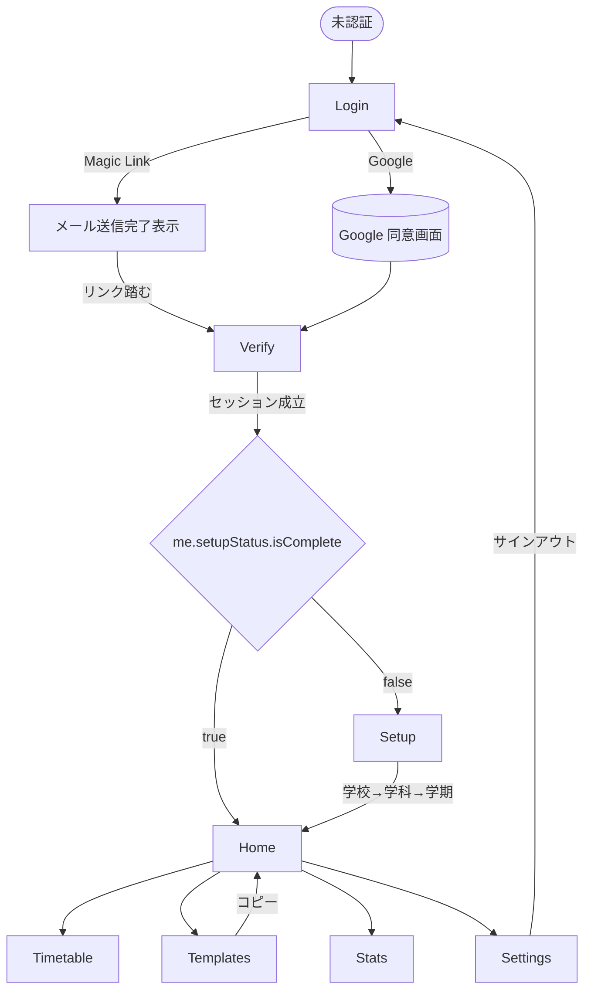
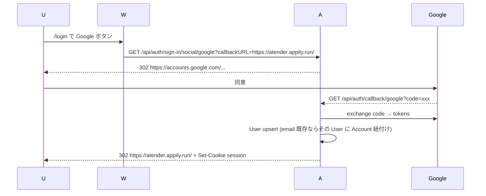

# Atender MVP 設計 doc (2026-05-13)

## Executive Summary

学生 (専門学校・大学) 向け、**時間割登録 + ワンタッチ出欠 + 出席率追跡** の Web アプリ MVP。Web 単独 (`atender.appily.run`) で公開し、後続 Phase 2 で iPhone (SwiftUI) ネイティブ化する想定。

**主要設計判断 (3 つ)**:
1. **完全分離型スタック** — Hono Node + better-auth 1.6.x の API (`apps/api`) と Vite + React 19 の SPA (`apps/web`) を Coolify 2 service に分け、API は将来 iPhone からも素直に叩ける形にする (Researcher 推奨の Next.js 1 体型は不採用、理由は §13)
2. **slot 多重 (`period_offset`) の出欠表現** — 連続コマは `Meeting` 1 行 + `MeetingOccurrence` 複数行で記録、出席率は単純な `count(present_eq) / count(denominator)` で算出。weight をアプリ層に染み出させない
3. **学校・学科デフォルト + ユーザー個別上書きの 2 段ルール** — `AttendanceRule` を `(school_id, department_id)` キーの行 + `(user_id)` キーの上書き行で表現。公欠 / 遅刻 / 早退の扱いを `COUNT_AS_PRESENT` / `REDUCE_DENOMINATOR` / `HALF_PRESENT` / `COUNT_AS_ABSENT` / `SEPARATE_COUNT` から選ぶ

**Phase 1 (MVP) で除外する範囲**: iPhone ネイティブ・Apple Sign-In・PWA push・通知・学科正規化・テンプレ「お気に入り / 評価」機能・FTS5 全文検索・タイムゾーン切替 UI (固定: `Asia/Tokyo`)・複数年度跨ぎ自動繰越・出席率の週単位/月単位ピボット表示。

---

## 1. 目的・スコープ

### 目的

Touri 自身を含む専門学校・大学生が、毎朝開く 1 画面で「今日のコマ + ワンタッチ出席」を済ませ、学期通しての出席率を把握できる Web アプリを最短で立ち上げる。時間割の再入力コストは **学校 + 学科** で public 共有された Template を選んでコピーする経路で削減する。

### ユーザー像

- 専門学校 3 年生 (Touri 本人)・大学生
- スマホ (iOS Safari / Android Chrome) と PC ブラウザ両方で使う
- 1 学期に **5-15 コマ** の時間割
- 既存出席管理アプリ (例: tally / AttendEase) は使っていないか満足していない

### MVP に入れる機能

| # | 機能 | 概要 |
|---|------|------|
| F1 | 認証 (Magic Link + Google OAuth) | better-auth + Resend、cookie session 30 日 |
| F2 | 初回 setup | 学校選択 / 学科入力 / 学期作成 を強制 |
| F3 | 時間割テンプレ public 検索 | `(school_id, department_id)` で絞り込み、最終更新降順 |
| F4 | テンプレを自分の時間割にコピー | `DaySlot` / `Course` / `Meeting` を deep copy、lineage 保持 |
| F5 | 時間割を自作 | ゼロから `DaySlot` / `Course` / `Meeting` を作成 |
| F6 | テンプレ public 公開 | 自分の時間割を Template として開放 |
| F7 | 今日のコマ表示 (Home) | tz=`Asia/Tokyo` の当日 `MeetingOccurrence` 一覧 |
| F8 | ワンタッチ「すべて出席」 | 当日 occurrence のうち未記録分に `PRESENT` を一括記録 |
| F9 | 個別状態切替 | 6 状態 (`PRESENT`/`ABSENT`/`EXCUSED`/`TARDY`/`EARLY_LEAVE`/`CANCELLED`) を切替 |
| F10 | 出席率統計 | Course ごとの分子 / 分母 / 率を返す API + 画面 |
| F11 | AttendanceRule 編集 | school+department デフォルト + user 個別上書き |
| F12 | マスコット表示 | Home 挨拶エリア / 404 / loading で Codex 生成画像を出す |

### MVP に入れない機能 (Phase 2 / v2 送り)

| # | 機能 | 理由 |
|---|------|------|
| N1 | iPhone ネイティブ (SwiftUI) | Phase 2、§12 で移行戦略のみ確定 |
| N2 | Apple Sign-In | iPhone 着手時に追加 |
| N3 | PWA push / 通知 | iOS の信頼性低、Phase 2 で Local Notification |
| N4 | 学科の正規化 (kuromoji・LLM 寄せ) | 公的データ不在、MVP は string match で十分 |
| N5 | テンプレお気に入り / 評価 / ランキング | 共有が動くこと自体を MVP のゴールに |
| N6 | FTS5 全文検索 | テンプレ数千件規模では `LIKE` で十分 |
| N7 | 複数 tz 切替 | `Asia/Tokyo` 固定、海外ユーザーは Phase 2 |
| N8 | 年度跨ぎ自動繰越 | 学期は手動作成 |
| N9 | 出席率の週/月ピボット | MVP は Course ごと 1 数値で出す |
| N10 | テンプレ削除済の lineage 切断処理 | コピー時点で deep copy しているので参照は失わない、`source_template_id` を null にするだけ |

---

## 2. システム構成

### monorepo レイアウト

```
atender/
├── package.json                  # workspaces root, pnpm
├── pnpm-workspace.yaml
├── tsconfig.base.json
├── apps/
│   ├── api/                      # Hono on Node
│   │   ├── package.json
│   │   ├── Dockerfile
│   │   ├── entrypoint.sh
│   │   ├── prisma/
│   │   │   ├── schema.prisma
│   │   │   ├── seed.ts           # 文科省 school CSV → School テーブル
│   │   │   └── data/
│   │   │       └── schools.csv   # 令和7年12月版、build 時に取り込み
│   │   ├── src/
│   │   │   ├── index.ts          # serve(app, { port })
│   │   │   ├── app.ts            # Hono app + middleware + routes
│   │   │   ├── auth.ts           # betterAuth({ ... })
│   │   │   ├── db.ts             # PrismaClient singleton
│   │   │   ├── env.ts            # zod で env 検証
│   │   │   ├── middleware/
│   │   │   │   ├── session.ts    # auth.api.getSession で c.set("user")
│   │   │   │   ├── setupGuard.ts # SETUP_REQUIRED 検出
│   │   │   │   ├── cors.ts
│   │   │   │   └── error.ts      # AppError → JSON
│   │   │   ├── routes/
│   │   │   │   ├── auth.ts       # /api/auth/** (better-auth handler)
│   │   │   │   ├── me.ts
│   │   │   │   ├── schools.ts
│   │   │   │   ├── departments.ts
│   │   │   │   ├── semesters.ts
│   │   │   │   ├── templates.ts
│   │   │   │   ├── userTimetables.ts
│   │   │   │   ├── meetings.ts
│   │   │   │   ├── today.ts
│   │   │   │   ├── attendance.ts
│   │   │   │   ├── stats.ts
│   │   │   │   └── rules.ts
│   │   │   ├── services/
│   │   │   │   ├── templateCopy.ts     # Template → UserTimetable deep copy
│   │   │   │   ├── occurrenceGen.ts    # Meeting + Semester → MeetingOccurrence 生成
│   │   │   │   ├── attendanceStats.ts  # 出席率算出
│   │   │   │   └── rules.ts            # 学校 + 学科 + user 3 段 merge
│   │   │   └── lib/
│   │   │       ├── appError.ts
│   │   │       └── tz.ts         # `Asia/Tokyo` 固定の today() ヘルパ
│   │   ├── tests/                # vitest (in-memory SQLite)
│   │   │   ├── _setup.ts
│   │   │   ├── auth.test.ts
│   │   │   ├── templates.test.ts
│   │   │   ├── attendance.test.ts
│   │   │   ├── stats.test.ts
│   │   │   └── ...
│   │   ├── tsconfig.json
│   │   └── vitest.config.ts
│   └── web/                      # Vite + React 19 + TS SPA
│       ├── package.json
│       ├── Dockerfile            # multi-stage (build → nginx)
│       ├── nginx.conf
│       ├── index.html
│       ├── vite.config.ts
│       ├── tsconfig.json
│       ├── vitest.config.ts      # jsdom mode
│       ├── public/
│       │   ├── character/        # Codex 生成画像
│       │   │   ├── mascot-hello-1024.png
│       │   │   ├── mascot-thinking-1024.png
│       │   │   ├── mascot-404-1024.png
│       │   │   └── favicon-256.png
│       │   └── og-default-1200x630.png
│       ├── src/
│       │   ├── main.tsx
│       │   ├── App.tsx
│       │   ├── router.tsx        # TanStack Router (file-based not, code 定義)
│       │   ├── lib/
│       │   │   ├── api.ts        # fetch wrapper, credentials: 'include'
│       │   │   ├── authClient.ts # better-auth client (createAuthClient)
│       │   │   └── tz.ts
│       │   ├── hooks/
│       │   │   ├── useSession.ts
│       │   │   └── useToday.ts
│       │   ├── components/
│       │   │   ├── SessionGuard.tsx
│       │   │   ├── SetupGuard.tsx
│       │   │   ├── Mascot.tsx
│       │   │   ├── OccurrenceCard.tsx
│       │   │   ├── StatusPicker.tsx
│       │   │   └── ...
│       │   ├── pages/
│       │   │   ├── Login.tsx
│       │   │   ├── Verify.tsx
│       │   │   ├── Setup.tsx
│       │   │   ├── Home.tsx
│       │   │   ├── Timetable.tsx
│       │   │   ├── TemplateSearch.tsx
│       │   │   ├── Stats.tsx
│       │   │   ├── Settings.tsx
│       │   │   └── NotFound.tsx
│       │   └── styles/
│       │       └── global.css
│       └── tests/                # vitest + RTL
└── packages/
    └── shared/                   # 型 / Zod schema 共有
        ├── package.json
        ├── tsconfig.json
        ├── src/
        │   ├── index.ts
        │   ├── schemas/
        │   │   ├── attendance.ts
        │   │   ├── meeting.ts
        │   │   ├── school.ts
        │   │   ├── semester.ts
        │   │   ├── template.ts
        │   │   ├── userTimetable.ts
        │   │   ├── rules.ts
        │   │   └── api.ts
        │   └── enums.ts          # AttendanceStatus / RuleStrategy 等
```

### 2 service のサービス境界

| service | 役割 | 公開ポート / ドメイン | 永続層 |
|---|---|---|---|
| `atender-api` | Hono Node サーバ。better-auth handler / 業務 API / Prisma CLI による migration | `https://api.atender.appily.run` (`:3000`) | SQLite (`/app/data/prod.db`) + Resend SDK |
| `atender-web` | Vite ビルド成果物を Nginx 配信。SPA、API は credentials: include で叩く | `https://atender.appily.run` (`:80`) | なし (静的) |

**cookie 共通親ドメイン**: `appily.run` (両 service が同じ親ドメイン下なので `SameSite=Lax` で cross-subdomain cookie が成立。`cookieDomain=".appily.run"` を better-auth 側で指定。Phase 2 の iPhone (`capacitor://localhost` or SwiftUI) では `SameSite=None; Secure` + `trustedOrigins` に切替)。

### 依存パッケージ (主要、version 込み)

Researcher findings の `npm view` 数値を引用 (2026-05-13 時点):

**apps/api**
- `hono@4.12.18` (publish 2026-05-06)
- `@hono/node-server@2.0.2`
- `better-auth@1.6.11` (publish 2026-05-12, stable)
- `@better-auth/cli@1.6.11` (Prisma schema 生成)
- `prisma@6.19.3` (7.x の `prisma.config.ts` 必須化を避けるため 6.x 固定)
- `@prisma/client@6.19.3`
- `better-sqlite3@11.x` (Prisma SQLite adapter)
- `resend@4.12.18` (publish 2026-05-06)
- `zod@3.23.x`
- `dayjs@1.11.x` + `dayjs/plugin/timezone` + `dayjs/plugin/utc`

**apps/web**
- `react@19.x` / `react-dom@19.x`
- `vite@6.x` + `@vitejs/plugin-react`
- `typescript@5.x`
- `@tanstack/react-router@1.x` (code-defined routes)
- `@tanstack/react-query@5.x` (API state)
- `better-auth@1.6.11` (client 側 `createAuthClient`)
- `zod@3.23.x`
- `dayjs@1.11.x`

**packages/shared**
- `zod@3.23.x` のみ (型 + schema 提供)

**dev / 共通**
- `vitest@2.x`
- `@vitest/coverage-v8`
- `@testing-library/react@16.x`
- `jsdom@25.x`
- `tsx@4.x` (api dev runner)

### 環境変数

**apps/api**

| キー | 例 | 用途 |
|---|---|---|
| `NODE_ENV` | `production` (Coolify env では設定しない、Dockerfile 内宣言) | runtime |
| `DATABASE_URL` | `file:/app/data/prod.db` | Prisma SQLite |
| `BETTER_AUTH_SECRET` | 32 byte hex random | better-auth |
| `BETTER_AUTH_URL` | `https://api.atender.appily.run` | better-auth |
| `BETTER_AUTH_TRUSTED_ORIGINS` | `https://atender.appily.run` (CSV) | CORS / cookie |
| `BETTER_AUTH_COOKIE_DOMAIN` | `.appily.run` | cookie scope |
| `GOOGLE_CLIENT_ID` | `xxx.apps.googleusercontent.com` | OAuth |
| `GOOGLE_CLIENT_SECRET` | `GOCSPX-...` | OAuth |
| `RESEND_API_KEY` | `re_xxx` | Magic Link |
| `RESEND_FROM` | `Atender <noreply@atender.appily.run>` | Magic Link sender |
| `PUBLIC_WEB_URL` | `https://atender.appily.run` | Magic Link 着地 (`/verify?token=...`) |
| `PORT` | `3000` | Hono listen |

**apps/web** (Vite では `VITE_` prefix 必須)

| キー | 例 | 用途 |
|---|---|---|
| `VITE_API_URL` | `https://api.atender.appily.run` | API base URL |
| `VITE_APP_URL` | `https://atender.appily.run` | self ref (Google OAuth callback display) |

---

## 3. データモデル (Prisma schema 完全形)

```prisma
// apps/api/prisma/schema.prisma
generator client {
  provider = "prisma-client-js"
}

datasource db {
  provider = "sqlite"
  url      = env("DATABASE_URL")
}

// ===== better-auth 4 テーブル (CLI 生成形、Atender カスタムを追加) =====

model User {
  id            String    @id
  email         String    @unique
  emailVerified Boolean   @default(false)
  name          String?
  image         String?
  createdAt     DateTime  @default(now())
  updatedAt     DateTime  @updatedAt

  // Atender 拡張
  // 所属 (setup で確定。Magic Link 直後は null 許容、初回 setup 完了で必ず両方 NOT NULL になる)
  schoolId          String?
  school            School?   @relation("UserSchool", fields: [schoolId], references: [id], onDelete: SetNull)
  departmentId      String?
  department        Department? @relation("UserDepartment", fields: [departmentId], references: [id], onDelete: SetNull)
  defaultSemesterId String?
  defaultSemester   Semester? @relation("UserDefaultSemester", fields: [defaultSemesterId], references: [id], onDelete: SetNull)

  accounts        Account[]
  sessions        Session[]
  semesters       Semester[]      @relation("UserSemesters")
  userTimetables  UserTimetable[]
  attendanceRecords AttendanceRecord[]
  attendanceRules AttendanceRule[]
  authoredTemplates TimetableTemplate[] @relation("AuthoredTemplates")
  createdSchools  School[]        @relation("UserCreatedSchools")
  createdDepartments Department[] @relation("UserCreatedDepartments")

  @@index([schoolId, departmentId])
}

model Account {
  id                    String    @id
  accountId             String    // provider's user id
  providerId            String    // "google" | "credential" | "magic-link"
  userId                String
  user                  User      @relation(fields: [userId], references: [id], onDelete: Cascade)
  accessToken           String?
  refreshToken          String?
  idToken               String?
  accessTokenExpiresAt  DateTime?
  refreshTokenExpiresAt DateTime?
  scope                 String?
  password              String?   // (Atender では未使用、better-auth 既定スキーマ準拠)
  createdAt             DateTime  @default(now())
  updatedAt             DateTime  @updatedAt

  @@unique([providerId, accountId])
  @@index([userId])
}

model Session {
  id        String   @id
  userId    String
  user      User     @relation(fields: [userId], references: [id], onDelete: Cascade)
  token     String   @unique
  expiresAt DateTime
  ipAddress String?
  userAgent String?
  createdAt DateTime @default(now())
  updatedAt DateTime @updatedAt

  @@index([userId])
  @@index([expiresAt])
}

model Verification {
  id         String   @id
  identifier String   // email or token id (better-auth が制御)
  value      String   // token hash
  expiresAt  DateTime
  createdAt  DateTime @default(now())
  updatedAt  DateTime @updatedAt

  @@index([identifier])
  @@index([expiresAt])
}

// ===== Atender 独自テーブル =====

model School {
  id          String   @id @default(cuid())
  mextCode    String?  @unique                     // 文科省 学校コード、ユーザー入力学校は null
  kind        SchoolKind
  name        String
  nameKana    String?
  prefecture  String?
  createdByUserId String?
  createdBy   User?    @relation("UserCreatedSchools", fields: [createdByUserId], references: [id], onDelete: SetNull)
  createdAt   DateTime @default(now())
  updatedAt   DateTime @updatedAt

  departments       Department[]
  attendanceRules   AttendanceRule[]
  timetableTemplates TimetableTemplate[]
  usersBelonging    User[]           @relation("UserSchool")

  @@index([name])
  @@index([prefecture])
}

enum SchoolKind {
  UNIVERSITY
  JUNIOR_COLLEGE        // 短期大学
  TECHNICAL_COLLEGE     // 高等専門学校
  VOCATIONAL_SCHOOL     // 専修学校 (専門学校)
  HIGH_SCHOOL
  OTHER
}

model Department {
  id          String   @id @default(cuid())
  schoolId    String
  school      School   @relation(fields: [schoolId], references: [id], onDelete: Cascade)
  name        String
  nameKana    String?
  source      DepartmentSource @default(USER)
  createdByUserId String?
  createdBy   User?    @relation("UserCreatedDepartments", fields: [createdByUserId], references: [id], onDelete: SetNull)
  createdAt   DateTime @default(now())
  updatedAt   DateTime @updatedAt

  attendanceRules    AttendanceRule[]
  timetableTemplates TimetableTemplate[]
  usersBelonging     User[]            @relation("UserDepartment")

  @@unique([schoolId, name])
  @@index([schoolId])
}

enum DepartmentSource {
  MEXT    // (将来用、MVP では使われない)
  USER
}

model Semester {
  id        String   @id @default(cuid())
  userId    String
  user      User     @relation("UserSemesters", fields: [userId], references: [id], onDelete: Cascade)
  name      String              // "2026 前期" 等、自由文字列
  startDate DateTime            // 日付 (時刻は 00:00:00 JST)
  endDate   DateTime            // 日付 (時刻は 23:59:59 JST)
  createdAt DateTime @default(now())
  updatedAt DateTime @updatedAt

  userTimetables UserTimetable[]
  usersAsDefault User[]   @relation("UserDefaultSemester")

  @@index([userId])
}

// ===== 時間割テンプレ (public 共有) =====

model TimetableTemplate {
  id           String   @id @default(cuid())
  authorUserId String
  author       User     @relation("AuthoredTemplates", fields: [authorUserId], references: [id], onDelete: Cascade)
  schoolId     String
  school       School   @relation(fields: [schoolId], references: [id], onDelete: Cascade)
  departmentId String
  department   Department @relation(fields: [departmentId], references: [id], onDelete: Cascade)
  title        String              // "2026 前期 情報処理科 2年" 等
  description  String?
  year         Int?                // 学年 (1-4)、null 可
  term         String?             // "前期" / "後期" / "通年" 等の自由文字列
  isPublic     Boolean  @default(true)
  copyCount    Int      @default(0)
  createdAt    DateTime @default(now())
  updatedAt    DateTime @updatedAt

  daySlots TemplateDaySlot[]
  courses  TemplateCourse[]
  meetings TemplateMeeting[]
  copies   UserTimetable[]

  @@index([schoolId, departmentId, updatedAt(sort: Desc)])
  @@index([authorUserId])
}

// Template 配下の DaySlot / Course / Meeting は UserTimetable 配下と
// 完全に同形 (Uniform Shape) で別テーブル。コピー時に行を複製。
// 別テーブルにする理由: TimetableTemplate と UserTimetable で
// FK の参照先が異なるため (Prisma が SQLite で polymorphic FK を持てない)。

model TemplateDaySlot {
  id          String @id @default(cuid())
  templateId  String
  template    TimetableTemplate @relation(fields: [templateId], references: [id], onDelete: Cascade)
  periodIndex Int                    // 1, 2, 3, ... (1限 / 2限 / ...)
  label       String                 // "1限" / "昼休み" 等
  startMinute Int                    // 0:00 からの分 (例: 9:00 → 540)
  endMinute   Int
  isBreak     Boolean @default(false)

  @@unique([templateId, periodIndex])
  @@index([templateId])
}

model TemplateCourse {
  id          String @id @default(cuid())
  templateId  String
  template    TimetableTemplate @relation(fields: [templateId], references: [id], onDelete: Cascade)
  name        String
  teacher     String?
  room        String?
  color       String?              // "#RRGGBB" 等、UI hint
  totalSessions Int                // 学期通しの想定総コマ数 (Researcher 例: 15)
  note        String?

  meetings TemplateMeeting[]

  @@index([templateId])
}

model TemplateMeeting {
  id              String @id @default(cuid())
  templateId      String
  template        TimetableTemplate @relation(fields: [templateId], references: [id], onDelete: Cascade)
  courseId        String
  course          TemplateCourse @relation(fields: [courseId], references: [id], onDelete: Cascade)
  dayOfWeek       Int               // 0=日 ... 6=土 (JS 標準)
  startPeriodIndex Int              // 何限から始まるか (TemplateDaySlot.periodIndex 参照)
  periodCount      Int @default(1)  // 連続コマ数 (1, 2, 3, ...)。slot 多重表現

  @@index([templateId, dayOfWeek])
  @@index([courseId])
}

// ===== UserTimetable (ユーザー所有、コピー先) =====

model UserTimetable {
  id              String   @id @default(cuid())
  userId          String
  user            User     @relation(fields: [userId], references: [id], onDelete: Cascade)
  semesterId      String
  semester        Semester @relation(fields: [semesterId], references: [id], onDelete: Cascade)
  title           String
  sourceTemplateId String?
  sourceTemplate  TimetableTemplate? @relation(fields: [sourceTemplateId], references: [id], onDelete: SetNull)
  createdAt       DateTime @default(now())
  updatedAt       DateTime @updatedAt

  daySlots DaySlot[]
  courses  Course[]
  meetings Meeting[]

  @@index([userId, semesterId])
  @@unique([userId, semesterId])    // 1 user × 1 semester = 1 UserTimetable
}

model DaySlot {
  id              String @id @default(cuid())
  userTimetableId String
  userTimetable   UserTimetable @relation(fields: [userTimetableId], references: [id], onDelete: Cascade)
  periodIndex     Int
  label           String
  startMinute     Int
  endMinute       Int
  isBreak         Boolean @default(false)

  @@unique([userTimetableId, periodIndex])
  @@index([userTimetableId])
}

model Course {
  id              String @id @default(cuid())
  userTimetableId String
  userTimetable   UserTimetable @relation(fields: [userTimetableId], references: [id], onDelete: Cascade)
  name            String
  teacher         String?
  room            String?
  color           String?
  totalSessions   Int
  note            String?

  meetings Meeting[]
  occurrences MeetingOccurrence[] // 経由参照、検索インデックス用

  @@index([userTimetableId])
}

model Meeting {
  id              String @id @default(cuid())
  userTimetableId String
  userTimetable   UserTimetable @relation(fields: [userTimetableId], references: [id], onDelete: Cascade)
  courseId        String
  course          Course @relation(fields: [courseId], references: [id], onDelete: Cascade)
  dayOfWeek       Int
  startPeriodIndex Int
  periodCount     Int @default(1)

  occurrences MeetingOccurrence[]

  @@index([userTimetableId, dayOfWeek])
  @@index([courseId])
}

// ===== MeetingOccurrence (絶対日付の出欠記録単位) =====

model MeetingOccurrence {
  id            String  @id @default(cuid())
  meetingId     String
  meeting       Meeting @relation(fields: [meetingId], references: [id], onDelete: Cascade)
  courseId      String
  course        Course  @relation(fields: [courseId], references: [id], onDelete: Cascade)
  date          DateTime          // 開催日 (JST 00:00:00)
  periodOffset  Int                // 連続コマの何コマ目か (0-indexed)。periodCount=2 なら 2 行生成
  startMinute   Int                // 当日の絶対開始分 (snapshot、DaySlot 変更耐性のため)
  endMinute     Int

  attendanceRecord AttendanceRecord?

  @@unique([meetingId, date, periodOffset])
  @@index([courseId, date])
  @@index([date])
}

// ===== 出席記録 =====

enum AttendanceStatus {
  PRESENT      // 出席
  ABSENT       // 欠席
  EXCUSED      // 公欠
  TARDY        // 遅刻
  EARLY_LEAVE  // 早退
  CANCELLED    // 休講
}

model AttendanceRecord {
  id           String @id @default(cuid())
  occurrenceId String @unique
  occurrence   MeetingOccurrence @relation(fields: [occurrenceId], references: [id], onDelete: Cascade)
  userId       String                  // 検索インデックス用 (非正規化)
  user         User @relation(fields: [userId], references: [id], onDelete: Cascade)
  status       AttendanceStatus
  note         String?
  createdAt    DateTime @default(now())
  updatedAt    DateTime @updatedAt

  @@index([userId, createdAt])
}

// ===== 出欠ルール =====

enum RuleStrategy {
  COUNT_AS_PRESENT     // 出席として 1 カウント (分子+1, 分母+1)
  COUNT_AS_ABSENT      // 欠席として 0 カウント (分子+0, 分母+1)
  HALF_PRESENT         // 0.5 出席 (分子+0.5, 分母+1)
  REDUCE_DENOMINATOR   // 分母から除外 (分子+0, 分母+0)
  SEPARATE_COUNT       // 別カウント (出席率算出外、表示のみ)
}

model AttendanceRule {
  id           String  @id @default(cuid())
  // scope (school+department default は userId=null、user override は userId 指定)
  schoolId     String
  school       School  @relation(fields: [schoolId], references: [id], onDelete: Cascade)
  departmentId String
  department   Department @relation(fields: [departmentId], references: [id], onDelete: Cascade)
  userId       String?
  user         User?   @relation(fields: [userId], references: [id], onDelete: Cascade)

  // 6 status のうち PRESENT / ABSENT / CANCELLED は固定 (それぞれ
  // COUNT_AS_PRESENT, COUNT_AS_ABSENT, REDUCE_DENOMINATOR)。
  // 設定可能なのは EXCUSED / TARDY / EARLY_LEAVE の 3 つ。
  excusedStrategy    RuleStrategy @default(REDUCE_DENOMINATOR)
  tardyStrategy      RuleStrategy @default(HALF_PRESENT)
  earlyLeaveStrategy RuleStrategy @default(HALF_PRESENT)

  createdAt DateTime @default(now())
  updatedAt DateTime @updatedAt

  @@unique([schoolId, departmentId, userId])
  @@index([schoolId, departmentId])
  @@index([userId])
}
```

### index / 制約の要点

- `UserTimetable.@@unique([userId, semesterId])` で「同じ学期に 2 つ時間割」を禁止
- `MeetingOccurrence.@@unique([meetingId, date, periodOffset])` で重複生成防止
- `AttendanceRecord.occurrenceId @unique` で 1 occurrence : 1 record (override 時は upsert)
- `AttendanceRule.@@unique([schoolId, departmentId, userId])` でデフォ行 (`userId=null`) と user 上書き行 (`userId='xxx'`) が併存できる
  - SQLite/Prisma の `@@unique` は `null` 値を「distinct」扱いするので、null 同士の重複が起きない。MVP 範囲ではデフォルト行は 1 (school, department) ペアあたり 1 つだけ作る運用 (Service レイヤでガード)

### Researcher findings からの引用

- 連続コマ表現は **流派 Y (slot 多重)** を採用 (`MeetingOccurrence.periodOffset`) — Researcher §3 推奨
- `School` の `mextCode` は文科省「学校コード」CSV から seed、学科は `Department.source=USER` でユーザー入力 — Researcher §7
- better-auth 4 テーブル (`User`/`Account`/`Session`/`Verification`) は CLI 生成形に準拠 — Researcher §2

---

## 4. API シグネチャ (Hono Router)

### 共通仕様

- **Base URL**: `https://api.atender.appily.run`
- **認証**: cookie session (better-auth)。`credentials: 'include'` でフロントから送る
- **CORS**: `Access-Control-Allow-Origin: https://atender.appily.run` (single value)、`Access-Control-Allow-Credentials: true`
- **エラーレスポンス共通形**:
  ```ts
  // packages/shared/src/schemas/api.ts
  export const ErrorResponse = z.object({
    error: z.object({
      code: z.string(),    // "VALIDATION_ERROR" / "UNAUTHORIZED" / "SETUP_REQUIRED" / "NOT_FOUND" / "CONFLICT" / "FORBIDDEN" / "INTERNAL"
      message: z.string(),
      details: z.unknown().optional()
    })
  });
  ```
- **AppError class** (apps/api/src/lib/appError.ts):
  ```ts
  export class AppError extends Error {
    constructor(public status: number, public code: string, message: string, public details?: unknown) {
      super(message);
    }
  }
  // 例: throw new AppError(403, "SETUP_REQUIRED", "User must complete setup")
  ```
- **error middleware** は `c.json({ error: { code, message, details } }, err.status ?? 500)` のように status を **必ず第二引数で渡す** ([`gotcha/hono-error-middleware-apperror-status`] 既知罠)
- **未認証**: `401 { code: "UNAUTHORIZED" }`
- **未セットアップ**: `403 { code: "SETUP_REQUIRED" }` (学校 / 学科 / 学期 のいずれかが未設定の認証済ユーザーが、`/api/today` `/api/user-timetables/*` `/api/attendance/*` `/api/stats` 等を叩いた場合)

### packages/shared の Zod スキーマ

```ts
// packages/shared/src/enums.ts
export const ATTENDANCE_STATUS = ["PRESENT","ABSENT","EXCUSED","TARDY","EARLY_LEAVE","CANCELLED"] as const;
export type AttendanceStatus = (typeof ATTENDANCE_STATUS)[number];

export const RULE_STRATEGY = ["COUNT_AS_PRESENT","COUNT_AS_ABSENT","HALF_PRESENT","REDUCE_DENOMINATOR","SEPARATE_COUNT"] as const;
export type RuleStrategy = (typeof RULE_STRATEGY)[number];

export const SCHOOL_KIND = ["UNIVERSITY","JUNIOR_COLLEGE","TECHNICAL_COLLEGE","VOCATIONAL_SCHOOL","HIGH_SCHOOL","OTHER"] as const;
```

```ts
// packages/shared/src/schemas/school.ts
import { z } from "zod";
import { SCHOOL_KIND } from "../enums";

export const SchoolDto = z.object({
  id: z.string(),
  mextCode: z.string().nullable(),
  kind: z.enum(SCHOOL_KIND),
  name: z.string(),
  nameKana: z.string().nullable(),
  prefecture: z.string().nullable(),
});

export const SchoolSearchQuery = z.object({
  q: z.string().min(1).max(100).optional(),
  prefecture: z.string().max(20).optional(),
  kind: z.enum(SCHOOL_KIND).optional(),
  limit: z.coerce.number().int().min(1).max(50).default(20),
});

export const SchoolCreateInput = z.object({
  name: z.string().min(1).max(100),
  nameKana: z.string().max(100).optional(),
  kind: z.enum(SCHOOL_KIND),
  prefecture: z.string().max(20).optional(),
});

export const DepartmentDto = z.object({
  id: z.string(),
  schoolId: z.string(),
  name: z.string(),
  nameKana: z.string().nullable(),
});

export const DepartmentCreateInput = z.object({
  name: z.string().min(1).max(100),
  nameKana: z.string().max(100).optional(),
});
```

```ts
// packages/shared/src/schemas/semester.ts
export const SemesterDto = z.object({
  id: z.string(),
  name: z.string(),
  startDate: z.string(),       // ISO date (YYYY-MM-DD)
  endDate: z.string(),
});

export const SemesterCreateInput = z.object({
  name: z.string().min(1).max(50),
  startDate: z.string().regex(/^\d{4}-\d{2}-\d{2}$/),
  endDate: z.string().regex(/^\d{4}-\d{2}-\d{2}$/),
}).refine(v => v.startDate <= v.endDate, { message: "startDate must be <= endDate" });

export const SemesterUpdateInput = SemesterCreateInput.partial();
```

```ts
// packages/shared/src/schemas/template.ts
export const DaySlotDto = z.object({
  periodIndex: z.number().int().min(1).max(20),
  label: z.string().max(20),
  startMinute: z.number().int().min(0).max(1440),
  endMinute: z.number().int().min(0).max(1440),
  isBreak: z.boolean().default(false),
});

export const CourseDto = z.object({
  id: z.string(),
  name: z.string().max(100),
  teacher: z.string().max(50).nullable(),
  room: z.string().max(30).nullable(),
  color: z.string().regex(/^#[0-9a-fA-F]{6}$/).nullable(),
  totalSessions: z.number().int().min(1).max(60),
  note: z.string().max(500).nullable(),
});

export const MeetingDto = z.object({
  id: z.string(),
  courseId: z.string(),
  dayOfWeek: z.number().int().min(0).max(6),
  startPeriodIndex: z.number().int().min(1).max(20),
  periodCount: z.number().int().min(1).max(8).default(1),
});

export const TemplateDto = z.object({
  id: z.string(),
  authorUserId: z.string(),
  schoolId: z.string(),
  departmentId: z.string(),
  title: z.string(),
  description: z.string().nullable(),
  year: z.number().int().nullable(),
  term: z.string().nullable(),
  isPublic: z.boolean(),
  copyCount: z.number().int(),
  daySlots: z.array(DaySlotDto),
  courses: z.array(CourseDto),
  meetings: z.array(MeetingDto),
  createdAt: z.string(),
  updatedAt: z.string(),
});

export const TemplateSearchQuery = z.object({
  schoolId: z.string().optional(),
  departmentId: z.string().optional(),
  q: z.string().max(100).optional(),
  limit: z.coerce.number().int().min(1).max(50).default(20),
  cursor: z.string().optional(),   // updatedAt cursor
});

export const TemplateCreateInput = z.object({
  schoolId: z.string(),
  departmentId: z.string(),
  title: z.string().min(1).max(100),
  description: z.string().max(500).optional(),
  year: z.number().int().min(1).max(8).optional(),
  term: z.string().max(20).optional(),
  isPublic: z.boolean().default(true),
  daySlots: z.array(DaySlotDto).min(1).max(20),
  courses: z.array(z.object({
    tempId: z.string(),   // クライアント側生成、紐付け用
    name: z.string().min(1).max(100),
    teacher: z.string().max(50).optional(),
    room: z.string().max(30).optional(),
    color: z.string().regex(/^#[0-9a-fA-F]{6}$/).optional(),
    totalSessions: z.number().int().min(1).max(60),
    note: z.string().max(500).optional(),
  })).max(50),
  meetings: z.array(z.object({
    courseTempId: z.string(),
    dayOfWeek: z.number().int().min(0).max(6),
    startPeriodIndex: z.number().int().min(1).max(20),
    periodCount: z.number().int().min(1).max(8).default(1),
  })).max(200),
});

export const TemplateCopyInput = z.object({
  semesterId: z.string(),
  title: z.string().min(1).max(100).optional(),
});
```

```ts
// packages/shared/src/schemas/userTimetable.ts
export const UserTimetableDto = z.object({
  id: z.string(),
  userId: z.string(),
  semesterId: z.string(),
  title: z.string(),
  sourceTemplateId: z.string().nullable(),
  daySlots: z.array(DaySlotDto),
  courses: z.array(CourseDto),
  meetings: z.array(MeetingDto),
  createdAt: z.string(),
  updatedAt: z.string(),
});

export const UserTimetableCreateInput = TemplateCreateInput.omit({
  schoolId: true, departmentId: true, isPublic: true,
}).extend({
  semesterId: z.string(),
});

export const UserTimetablePatchInput = z.object({
  title: z.string().min(1).max(100).optional(),
  daySlots: z.array(DaySlotDto).optional(),
  courses: z.array(z.object({
    id: z.string().optional(),
    tempId: z.string().optional(),
    name: z.string().min(1).max(100),
    teacher: z.string().max(50).optional(),
    room: z.string().max(30).optional(),
    color: z.string().regex(/^#[0-9a-fA-F]{6}$/).optional(),
    totalSessions: z.number().int().min(1).max(60),
    note: z.string().max(500).optional(),
  })).optional(),
  meetings: z.array(z.object({
    id: z.string().optional(),
    courseId: z.string().optional(),
    courseTempId: z.string().optional(),
    dayOfWeek: z.number().int().min(0).max(6),
    startPeriodIndex: z.number().int().min(1).max(20),
    periodCount: z.number().int().min(1).max(8).default(1),
  })).optional(),
});
```

```ts
// packages/shared/src/schemas/attendance.ts
export const OccurrenceDto = z.object({
  id: z.string(),
  meetingId: z.string(),
  courseId: z.string(),
  courseName: z.string(),
  teacher: z.string().nullable(),
  room: z.string().nullable(),
  color: z.string().nullable(),
  date: z.string(),                  // ISO date
  periodIndex: z.number().int(),      // 当日の何限目か (startPeriodIndex + periodOffset)
  periodOffset: z.number().int(),
  startMinute: z.number().int(),
  endMinute: z.number().int(),
  status: z.enum(ATTENDANCE_STATUS).nullable(),  // 未記録は null
});

export const TodayResponse = z.object({
  date: z.string(),                  // 当日 (JST)
  occurrences: z.array(OccurrenceDto),
});

export const MarkAttendanceInput = z.object({
  status: z.enum(ATTENDANCE_STATUS),
  note: z.string().max(200).optional(),
});

export const MarkAllPresentInput = z.object({
  date: z.string().regex(/^\d{4}-\d{2}-\d{2}$/).optional(),  // 省略時は今日 (JST)
});

export const MarkAllPresentResponse = z.object({
  date: z.string(),
  markedCount: z.number().int(),     // 新規 PRESENT を記録した数
  skippedCount: z.number().int(),    // 既に何らかの記録があってスキップした数
});
```

```ts
// packages/shared/src/schemas/rules.ts
export const AttendanceRuleDto = z.object({
  id: z.string(),
  schoolId: z.string(),
  departmentId: z.string(),
  userId: z.string().nullable(),
  excusedStrategy: z.enum(RULE_STRATEGY),
  tardyStrategy: z.enum(RULE_STRATEGY),
  earlyLeaveStrategy: z.enum(RULE_STRATEGY),
});

export const AttendanceRuleUpsertInput = z.object({
  excusedStrategy: z.enum(RULE_STRATEGY),
  tardyStrategy: z.enum(RULE_STRATEGY),
  earlyLeaveStrategy: z.enum(RULE_STRATEGY),
});

export const EffectiveRuleResponse = z.object({
  default: AttendanceRuleDto.nullable(),     // school+department のデフォ
  userOverride: AttendanceRuleDto.nullable(), // 自分の上書き
  effective: z.object({                       // merge 結果 (user > default > system)
    excusedStrategy: z.enum(RULE_STRATEGY),
    tardyStrategy: z.enum(RULE_STRATEGY),
    earlyLeaveStrategy: z.enum(RULE_STRATEGY),
  }),
});
```

```ts
// packages/shared/src/schemas/stats.ts
export const CourseStatsDto = z.object({
  courseId: z.string(),
  courseName: z.string(),
  totalSessions: z.number().int(),       // Course.totalSessions
  generatedOccurrences: z.number().int(),// 当該 Semester で実際に生成された occurrence 数
  counts: z.object({
    present: z.number().int(),
    absent: z.number().int(),
    excused: z.number().int(),
    tardy: z.number().int(),
    earlyLeave: z.number().int(),
    cancelled: z.number().int(),
    unrecorded: z.number().int(),        // 過去日付なのに記録が無いもの
  }),
  effectiveNumerator: z.number(),         // 浮動小数 (HALF_PRESENT 対応)
  effectiveDenominator: z.number(),
  attendanceRate: z.number().nullable(),  // 0.0-1.0、分母 0 のとき null
  separateCounts: z.record(z.enum(ATTENDANCE_STATUS), z.number().int()).optional(), // SEPARATE_COUNT 適用時
});

export const StatsResponse = z.object({
  semesterId: z.string(),
  courses: z.array(CourseStatsDto),
});
```

### Endpoint 一覧

凡例: 認証必須 = `@auth`、setup 必須 = `@setup` (setupGuard middleware)。

#### 認証 (better-auth handler)

| Method | Path | 説明 |
|---|---|---|
| `*` | `/api/auth/**` | better-auth `auth.handler(c.req.raw)` に委譲。`/sign-in/magic-link`、`/sign-in/social`、`/sign-out`、`/get-session` 等 |

#### `/api/me` — セッション + setup 状態

| Method | Path | 認証 | Request | Response | エラー |
|---|---|---|---|---|---|
| GET | `/api/me` | @auth | (none) | `{ user: UserDto, setupStatus: { hasSchool, hasDepartment, hasSemester, hasUserTimetable, isComplete } }` | 401 |
| PATCH | `/api/me` | @auth | body: `MeUpdateInput` | `{ user: UserDto, setupStatus: ... }` | 401 / 400 / 404 (schoolId/departmentId 不在) |

`MeUpdateInput` (packages/shared に追加、全フィールド任意):
```ts
export const MeUpdateInput = z.object({
  schoolId: z.string().optional(),
  departmentId: z.string().optional(),
  defaultSemesterId: z.string().nullable().optional(),
  name: z.string().min(1).max(50).optional(),
}).refine(
  v => v.departmentId == null || v.schoolId != null,
  { message: "departmentId requires schoolId in the same request or already set on User" }
);
```

挙動: PATCH では `schoolId` 単独更新 / `schoolId` + `departmentId` 同時更新を許可。`departmentId` のみ単独更新する場合、サーバ側で「指定 `departmentId.schoolId` が User.schoolId と一致するか」を検証し、不一致なら `400 { code: "VALIDATION_ERROR", details: { reason: "DEPARTMENT_SCHOOL_MISMATCH" } }`。`schoolId` を変更した場合、既存 `User.departmentId` は **必ず同時に再指定** (整合性ガード)、未指定なら同上 400。

`UserDto`:
```ts
z.object({
  id: z.string(),
  email: z.string().email(),
  name: z.string().nullable(),
  image: z.string().nullable(),
  defaultSemesterId: z.string().nullable(),
  schoolId: z.string().nullable(),       // User.schoolId を直接返す (setup 未完了は null)
  departmentId: z.string().nullable(),   // User.departmentId を直接返す (setup 未完了は null)
});
```

#### `/api/schools`

| Method | Path | 認証 | Request | Response | エラー |
|---|---|---|---|---|---|
| GET | `/api/schools` | @auth | query: `SchoolSearchQuery` | `{ schools: SchoolDto[] }` | 401 / 400 |
| POST | `/api/schools` | @auth | body: `SchoolCreateInput` | `{ school: SchoolDto }` (201) | 401 / 400 / 409 (同名 + 同 prefecture + 同 kind 既存) |

検索仕様: `q` は `name` と `nameKana` 双方の `LIKE %q%` (case-insensitive)、`prefecture` は equal、`kind` は equal。`limit` 件まで `name` 昇順で返す。

#### `/api/schools/:schoolId/departments`

| Method | Path | 認証 | Request | Response | エラー |
|---|---|---|---|---|---|
| GET | `/api/schools/:schoolId/departments` | @auth | query: `{ q?: string, limit?: number }` | `{ departments: DepartmentDto[] }` | 401 / 404 (school 不在) |
| POST | `/api/schools/:schoolId/departments` | @auth | body: `DepartmentCreateInput` | `{ department: DepartmentDto }` (201) | 401 / 404 / 409 (同 schoolId+name 既存 → 既存 dept を返す代わりに 409 で id を返す) |

`409` レスポンス例:
```json
{ "error": { "code": "CONFLICT", "message": "Department already exists", "details": { "existingId": "dept_..." } } }
```

#### `/api/semesters`

| Method | Path | 認証 | Request | Response | エラー |
|---|---|---|---|---|---|
| GET | `/api/semesters` | @auth | (none) | `{ semesters: SemesterDto[] }` | 401 |
| POST | `/api/semesters` | @auth | body: `SemesterCreateInput` | `{ semester: SemesterDto }` (201) | 401 / 400 |
| GET | `/api/semesters/:id` | @auth | (none) | `{ semester: SemesterDto }` | 401 / 404 / 403 (他人の semester) |
| PATCH | `/api/semesters/:id` | @auth | body: `SemesterUpdateInput` | `{ semester: SemesterDto }` | 401 / 404 / 403 / 400 |
| DELETE | `/api/semesters/:id` | @auth | (none) | `200 { ok: true }` | 401 / 404 / 403 / 409 (UserTimetable に紐付いている場合) |

#### `/api/timetable-templates`

| Method | Path | 認証 | Request | Response | エラー |
|---|---|---|---|---|---|
| GET | `/api/timetable-templates` | @auth | query: `TemplateSearchQuery` | `{ templates: TemplateDto[], nextCursor: string \| null }` | 401 / 400 |
| GET | `/api/timetable-templates/:id` | @auth | (none) | `{ template: TemplateDto }` | 401 / 404 |
| POST | `/api/timetable-templates` | @auth | body: `TemplateCreateInput` | `{ template: TemplateDto }` (201) | 401 / 400 / 404 (school / dept 不在) |
| POST | `/api/timetable-templates/:id/copy` | @auth | body: `TemplateCopyInput` | `{ userTimetable: UserTimetableDto }` (201) | 401 / 404 / 409 (該当 semester に既に UserTimetable 存在) |
| PATCH | `/api/timetable-templates/:id` | @auth | body: `Partial<TemplateCreateInput>` | `{ template: TemplateDto }` | 401 / 404 / 403 (author 以外) |
| DELETE | `/api/timetable-templates/:id` | @auth | (none) | `{ ok: true }` | 401 / 404 / 403 |

検索ソート: `updatedAt DESC`。`cursor` = base64(updatedAt + id)。

#### `/api/user-timetables`

| Method | Path | 認証 | Request | Response | エラー |
|---|---|---|---|---|---|
| GET | `/api/user-timetables` | @auth | (none) | `{ userTimetables: UserTimetableDto[] }` | 401 |
| GET | `/api/user-timetables/:id` | @auth, @setup | (none) | `{ userTimetable: UserTimetableDto }` | 401 / 403 / 404 |
| POST | `/api/user-timetables` | @auth | body: `UserTimetableCreateInput` | `{ userTimetable: UserTimetableDto }` (201) | 401 / 400 / 409 (`@@unique([userId, semesterId])` 違反) |
| PATCH | `/api/user-timetables/:id` | @auth | body: `UserTimetablePatchInput` | `{ userTimetable: UserTimetableDto }` | 401 / 403 / 404 / 400 |
| DELETE | `/api/user-timetables/:id` | @auth | (none) | `{ ok: true }` | 401 / 403 / 404 |
| POST | `/api/user-timetables/:id/publish-as-template` | @auth, @setup | body: `{ title: string, description?: string, year?: number, term?: string }` | `{ template: TemplateDto }` | 401 / 403 / 404 / 403 `SCHOOL_OR_DEPT_NOT_SET` |

`POST /api/user-timetables/:id/publish-as-template`: ユーザーの時間割を Template として公開する F6 機能。`schoolId` / `departmentId` は **`User.schoolId` / `User.departmentId` をそのまま使う**。どちらかが `null` の場合は `403 { code: "SCHOOL_OR_DEPT_NOT_SET" }` を返す (`@setup` ガードが先に効くため通常到達しないが、二重防御)。`UserTimetable.sourceTemplateId` には依存しない (ゼロから自作した時間割でも公開できる)。

#### `/api/today` — 今日のコマ一覧

| Method | Path | 認証 | Request | Response | エラー |
|---|---|---|---|---|---|
| GET | `/api/today` | @auth, @setup | query: `{ date?: string }` (YYYY-MM-DD JST、省略時 = 今日) | `TodayResponse` | 401 / 403 |

`date` 指定で過去日も取得可能。返す `occurrences` は **当日に該当する `MeetingOccurrence` を全件**、`startMinute` 昇順。

#### `/api/attendance`

| Method | Path | 認証 | Request | Response | エラー |
|---|---|---|---|---|---|
| POST | `/api/attendance/:occurrenceId` | @auth, @setup | body: `MarkAttendanceInput` | `{ record: { occurrenceId, status, note, updatedAt } }` (200) | 401 / 403 / 404 (occurrence 不在 / 他人) |
| DELETE | `/api/attendance/:occurrenceId` | @auth, @setup | (none) | `{ ok: true }` | 401 / 403 / 404 |
| POST | `/api/attendance/mark-all-present` | @auth, @setup | body: `MarkAllPresentInput` | `MarkAllPresentResponse` | 401 / 403 / 400 |

`POST /api/attendance/:occurrenceId`: 既存記録は **status を上書き** (upsert)。

`DELETE /api/attendance/:occurrenceId`: 記録を削除して「未記録」に戻す。

#### `/api/stats`

| Method | Path | 認証 | Request | Response | エラー |
|---|---|---|---|---|---|
| GET | `/api/stats` | @auth, @setup | query: `{ semesterId: string }` | `StatsResponse` | 401 / 403 / 404 (semester 不在 / 他人) |

#### `/api/attendance-rules`

| Method | Path | 認証 | Request | Response | エラー |
|---|---|---|---|---|---|
| GET | `/api/attendance-rules` | @auth, @setup | query: `{ schoolId: string, departmentId: string }` | `EffectiveRuleResponse` | 401 / 403 / 404 |
| PATCH | `/api/attendance-rules/default` | @auth | body: `AttendanceRuleUpsertInput & { schoolId, departmentId }` | `{ rule: AttendanceRuleDto }` | 401 / 400 (`schoolId`/`departmentId` 不在) |
| PATCH | `/api/attendance-rules/user` | @auth | body: `AttendanceRuleUpsertInput & { schoolId, departmentId }` | `{ rule: AttendanceRuleDto }` | 401 / 400 |
| DELETE | `/api/attendance-rules/user` | @auth | query: `{ schoolId, departmentId }` | `{ ok: true }` | 401 / 404 |

`PATCH /api/attendance-rules/default` は **誰でも書き換え可能** (MVP の妥協)。一般のユーザーは UI からは `/user` のみアクセスでき、デフォルト編集は将来「学校管理者」ロール導入時に閉じる (Phase 2)。MVP は学生自身が共有設定する素朴な運用。

### サービス関数シグネチャ (主要)

```ts
// apps/api/src/services/templateCopy.ts
export async function copyTemplateToUser(args: {
  templateId: string;
  userId: string;
  semesterId: string;
  title?: string;
}): Promise<UserTimetable>;

// apps/api/src/services/occurrenceGen.ts
/**
 * Semester 全期間にわたって UserTimetable.meetings から
 * MeetingOccurrence を生成する。periodOffset 0..periodCount-1 を
 * それぞれ 1 行として作る。startMinute/endMinute は DaySlot から snapshot。
 * 既存 occurrence (同 meetingId, date, periodOffset) は skip。
 */
export async function generateOccurrencesForUserTimetable(args: {
  userTimetableId: string;
  fromDate?: Date;
  toDate?: Date;
}): Promise<{ created: number; skipped: number }>;

// apps/api/src/services/attendanceStats.ts
export async function computeCourseStats(args: {
  semesterId: string;
  userId: string;
  now?: Date;        // テスト注入用、未指定なら現在 JST
}): Promise<CourseStatsDto[]>;

// apps/api/src/services/rules.ts
/**
 * scope = { schoolId, departmentId, userId? } で
 * AttendanceRule の effective merge を返す。
 * 優先度: user override > school+department default > system default
 *   excused: REDUCE_DENOMINATOR
 *   tardy:   HALF_PRESENT
 *   earlyLeave: HALF_PRESENT
 */
export async function getEffectiveRule(args: {
  schoolId: string;
  departmentId: string;
  userId: string;
}): Promise<EffectiveRule>;
```

---

## 5. UI/UX 設計

### 画面リスト

| Path | Page | 認証 | setup | 説明 |
|---|---|---|---|---|
| `/login` | Login | 不要 | - | Email 入力 + Google ボタン |
| `/verify` | Verify | 不要 | - | Magic Link 着地、`?token=` を better-auth に投げる |
| `/setup` | Setup | 必要 | 不要 | 学校 → 学科 → 学期 の 3 step ウィザード |
| `/` | Home | 必要 | 必要 | 今日のコマ + ワンタッチ出席 |
| `/timetable` | Timetable | 必要 | 必要 | 自分の時間割エディタ (週ビュー) |
| `/templates` | TemplateSearch | 必要 | 必要 (任意) | 共有テンプレ検索 |
| `/stats` | Stats | 必要 | 必要 | Course ごとの出席率一覧 |
| `/settings` | Settings | 必要 | - | プロフィール / 学校・学科変更 / AttendanceRule 編集 / サインアウト |
| `/404` | NotFound | - | - | マスコット表示 |

### 画面遷移図 (Mermaid)



### Login

```
+--------------------------------------+
|                                      |
|   Atender::                          |
|   Attendance for students            |
|                                      |
|   メールアドレス                     |
|   [_______________________________]  |
|                                      |
|   [ ログインリンクを送る           ] |
|                                      |
|   ───────  または  ───────           |
|                                      |
|   [ G  Google でサインイン         ] |
|                                      |
|   - based in tokyo/chiba -           |
+--------------------------------------+
```

- 太字大見出し `Atender::` (aisaba 視覚言語、`::` プログラミング感)
- 背景: 黒→深ネイビーの縦グラデ
- ボタンは枠線のみ、塗り無し
- メール送信成功時はインライン文言で「メールを送信しました。15 分以内にリンクを開いてください」を表示し、再送ボタンを 60 秒後に有効化

### Verify

- 受け取った `?token=...` を `auth.magicLink.verify({ token })` (better-auth client) に渡す
- 成功 → `/` (または `?next=/timetable` 等の rememberd path) へ遷移
- 失敗 (token 失効 / 不一致) → エラー文言 + 「もう一度ログイン」リンク

### Setup (3 step)

```
Step 1/3: 学校を選ぶ
  [ 学校名で検索: __________________ ] [都道府県 ▾]
  ──────────────────
  ○ 千葉県立保健医療大学
  ○ 千葉工業大学
  ○ ...
  ───
  ＋ リストに無い学校を追加

Step 2/3: 学科を選ぶ (X 大学)
  [ 学科名で検索: __________________ ]
  ──────────────────
  ○ 情報処理科
  ○ ITスペシャリスト科
  ○ ...
  ───
  ＋ 学科を追加

Step 3/3: 学期を作る
  名前   [ 2026 前期 ___________ ]
  開始日 [ 2026-04-01 ▾ ]
  終了日 [ 2026-09-30 ▾ ]
  [ 完了して時間割を作る ]
```

3 step とも左に「戻る」、右に「次へ」。

完了時の API 連鎖 (フロント側のシーケンス):
1. Step 1 で学校選択/作成 → 必要なら `POST /api/schools` で id を得る
2. Step 2 で学科選択/作成 → 必要なら `POST /api/schools/:schoolId/departments` で id を得る
3. Step 1+2 完了直後に `PATCH /api/me { schoolId, departmentId }` を呼んで User に確定保存 (Step 3 進入前に確定させる。途中離脱しても次回ログイン時に Step 3 から再開できる)
4. Step 3 で `POST /api/semesters` → 返ってきた id で `PATCH /api/me { defaultSemesterId }` を呼ぶ
5. `/timetable` に遷移 (UserTimetable 作成は次画面で行う)。`setupStatus.isComplete` は UserTimetable を 1 件作るまで `false`

### Home (★ ワンタッチ出欠の主舞台)

```
+--------------------------------------+
|  [ 🦉 ]  2026-05-13  火曜            |    ← マスコット + 当日表示
|         こんにちは、Touri さん        |
+--------------------------------------+
|                                      |
|  [ すべて出席にする (4 件)         ] |    ← 大きな primary ボタン
|                                      |
+--------------------------------------+
|  1限 09:00-10:30                     |
|   オペレーティングシステム           |
|   先生: 山田  / 教室: 305            |
|   [出席] [欠席] [公欠] [遅刻] ...    |    ← 状態ピル (現状態強調)
+--------------------------------------+
|  2限 10:40-12:10                     |
|   データベース論                     |
|   先生: 佐藤  / 教室: 305            |
|   [● 出席]  ← 既に記録済             |
+--------------------------------------+
|  ...                                 |
+--------------------------------------+
|  [ Timetable ] [ Templates ]         |    ← 下部ナビ (モバイル)
|  [ Stats ]    [ Settings  ]          |
+--------------------------------------+
```

#### ワンタッチ出欠の挙動 (詳細)

1. **マウント時**: `GET /api/today` を fetch、`occurrences` 配列を取得
2. **「すべて出席にする」ボタン**:
   - 表示テキスト: `すべて出席にする (N 件)`、N = `occurrences.filter(o => o.status == null).length`
   - N = 0 のとき disabled、ラベルは `本日の記録は完了済`
   - 押下 → `POST /api/attendance/mark-all-present { date: today }`
   - レスポンス `markedCount` 分の occurrence を **楽観更新で `PRESENT` に**
   - 失敗 (5xx / network) → トースト「保存できませんでした、もう一度試してください」+ 楽観更新をロールバック
3. **個別 occurrence カード**:
   - `status == null` のとき: 6 状態ボタンを横並びピル表示 (`出席 / 欠席 / 公欠 / 遅刻 / 早退 / 休講`)。タップで即 `POST /api/attendance/:occurrenceId`
   - `status != null` のとき: 現状態 1 つだけ強調表示 + 右に小さな「変更」リンク。タップで再度 6 状態ピル展開
   - 楽観更新方針: 即時 UI 反映 → API 成功で確定、失敗で元の状態 + トースト
4. **長押し対応**: モバイルで occurrence カード本体を長押し → bottom sheet で 6 状態 + note 入力欄が出る。デスクトップは右クリックメニュー
5. **未来日付の occurrence**: 表示はするが「出席」記録ボタンは disable しない (ユーザーが事前にチェックするのを禁止しない。MVP では信頼ベース)
6. **`CANCELLED` (休講) を全員で押した日**: 「みんな休講にしてる、本当に休講?」の確認ダイアログは出さない (Phase 2)

### Timetable (週ビューエディタ)

```
[ 2026 前期 ▾ ]  [ + 新規授業 ]  [ テンプレ公開 ]
+----+----+----+----+----+----+
|    | 月 | 火 | 水 | 木 | 金 |
+----+----+----+----+----+----+
|1限 | OS |    |    |    | DB |
|    | 山田|    |    |    | 佐藤|
+----+----+----+----+----+----+
|2限 | OS | DB |    |    | DB |   ← 1-2連続コマは縦に伸びる表示
|    | 山田|佐藤|    |    | 佐藤|
+----+----+----+----+----+----+
|3限 |    |    |プロ|    |    |
+----+----+----+----+----+----+
```

- セルタップで授業詳細 modal (Course + Meeting 編集)
- 「+ 新規授業」で空 modal、Course と Meeting を同時作成
- 「テンプレ公開」→ `POST /api/user-timetables/:id/publish-as-template` の確認 modal

### TemplateSearch

```
[ 学校 ▾ X 大学 ]  [ 学科 ▾ 情報処理科 ]
+--------------------------------------+
|  2026 前期 情報処理科 2 年           |
|  by @author_handle  copy x 12        |
|  更新: 2026-04-02                    |
|  [ 詳細を見る ] [ 自分の時間割に ]   |
+--------------------------------------+
|  2025 後期 情報処理科 1 年           |
|  ...                                 |
+--------------------------------------+
```

- 「自分の時間割に」→ semester 選択 modal → `POST /api/timetable-templates/:id/copy`
- 既に該当 semester に UserTimetable があると 409、UI は「既に時間割があります。上書きしますか?」 (上書きは MVP では非対応、別 semester を選び直すか既存削除)

### Stats

```
2026 前期

オペレーティングシステム
  □□□■■■■■■■■■■■■   13/15  86.7%
  出席 12  欠席 1  公欠 1 (分母除外)  休講 1

データベース論
  ...
```

- 進捗バーは ASCII 等価で 15 マス分、出席=塗り、欠席=空、公欠=灰(REDUCE 適用なら未計上)
- 各 Course 行をタップすると `/stats/:courseId` 詳細 (Phase 2、MVP では行展開のみ)

### Settings

- プロフィール (email、name、image — Google から自動取得済)
- デフォルト学期切替 (UserTimetable の主表示用)
- AttendanceRule
  - 学校 + 学科のデフォルト (誰でも閲覧、編集可能、警告文「これは共有設定です」)
  - 自分の上書き
- 学校・学科変更 (`PATCH /api/me { schoolId, departmentId }` を呼ぶ。UserTimetable 紐付けは消えないが Department 変更時は警告: 「テンプレ検索は新しい学科で行われます」)
- サインアウト
- 危険操作: 「アカウント削除」(User cascade 削除、確認 modal で email 再入力)

### aisaba 視覚デザイン言語との整合

[`pattern/aisaba-design-language`] に従う:
- カラー: 背景 `#000` → `#0a1830` の縦グラデ、テキスト `#f0f0f0`、アクセント色は使わず白の濃淡で表現
- 太字 sans-serif: `Helvetica Neue Bold` / `Inter Bold` / `Noto Sans JP Bold` のフォントスタック
- 大見出し `Atender::` のように `::` 名前空間風サフィックスを画面タイトルに採用 (`Home::`, `Today::`, `Stats::`)
- 装飾最小、罫線/枠線は極力使わず、余白で区切る
- ボタンは枠線のみ、ホバーで `opacity: 0.7` fade。primary ボタン (例: ワンタッチ出席) のみ白塗り + 黒文字で **唯一の強コントラスト**
- カードに影/角丸軽め (`border-radius: 8px`、`box-shadow` なし)
- マスコット画像はカード外の余白に控えめに置く (装飾は最小限の例外)
- マーケ語禁止 (「画期的」「シームレス」等)

### レスポンシブ

- モバイル幅 first (`min-width: 320px` 動作)
- ブレークポイント: `sm: 640px`, `md: 768px`, `lg: 1024px`
- モバイルは下部タブナビ、tablet 以上は左サイドナビ
- Home の occurrence カードは縦 1 列、768px+ で 2 列

---

## 6. 認証フロー

### Magic Link フロー

```mermaid
sequenceDiagram
  participant U as User (Browser)
  participant W as apps/web (atender.appily.run)
  participant A as apps/api (api.atender.appily.run)
  participant BA as better-auth
  participant R as Resend
  U->>W: /login で email 入力 + 送信
  W->>A: POST /api/auth/sign-in/magic-link {email, callbackURL: "https://atender.appily.run/verify"}
  A->>BA: signIn.magicLink({email, callbackURL})
  BA->>BA: token 発行、Verification 行作成 (expiresAt = now + 15 min)、url 組み立て (BETTER_AUTH_URL + callbackURL + token)
  BA->>BA: sendMagicLink({ email, url, token }) callback 起動
  BA->>R: resend.emails.send({from, to: email, html: '<a href="${url}">...</a>'})
  R-->>BA: ok
  BA-->>A: { ok: true }
  A-->>W: 200
  W->>U: 「メール送信しました」表示

  U->>U: メール受信、リンククリック
  U->>W: GET /verify?token=xxx
  W->>A: GET /api/auth/magic-link/verify?token=xxx (better-auth handler)
  A->>BA: verify token
  BA->>BA: Verification 行と照合、expiresAt 確認、User upsert、Session 作成
  BA-->>A: Set-Cookie: better-auth.session_token=...; Domain=.appily.run; SameSite=Lax; HttpOnly; Secure
  A-->>W: 302 https://atender.appily.run/
  W->>A: GET /api/me (cookie 同行)
  A-->>W: { user, setupStatus }
  W->>U: setupStatus.isComplete ? Home : Setup
```

### Google OAuth フロー



### セッション cookie

- 名前: `better-auth.session_token` (better-auth デフォルト)
- 属性: `Domain=.appily.run; Path=/; HttpOnly; Secure; SameSite=Lax`
- 有効期間: **30 日** (`session.expiresIn: 60 * 60 * 24 * 30`)
- リフレッシュ: better-auth デフォルト (`updateAge: 60 * 60 * 24` = 1 日経過時にセッション行を再生成)

### API 認証 (cookie ベース)

- フロントは `fetch(API_URL + path, { credentials: 'include' })`
- API 側は CORS で `Access-Control-Allow-Origin: https://atender.appily.run` (single value、`*` ではない)、`Access-Control-Allow-Credentials: true`
- session middleware (`apps/api/src/middleware/session.ts`):
  ```ts
  const session = await auth.api.getSession({ headers: c.req.raw.headers });
  if (!session?.user) throw new AppError(401, "UNAUTHORIZED", "...");
  c.set("user", session.user);
  c.set("session", session.session);
  ```

### 初回ログイン後の setup 強制フロー

- `setupGuard` middleware: `@setup` 付き route で、User が以下を **全て** 満たさない場合 `403 { code: "SETUP_REQUIRED" }`:
  1. `User.schoolId != null`
  2. `User.departmentId != null`
  3. `User.defaultSemesterId != null` かつそれが当該 User の Semester を指している
  4. その Semester に紐付く UserTimetable が 1 件以上 (`@@unique([userId, semesterId])` で最大 1 件)
- 上記 4 条件の AND で `isComplete = true`。1 個でも欠ければ `false`
- `User.schoolId` / `User.departmentId` は schema 上は **nullable のまま運用** (Magic Link 直後の中間状態を許容)。「初回 setup 完了後は必ず両方 NOT NULL」はアプリ層の不変条件として保つ (= ガード突破済みのユーザーに対しては常に両方 set)
- フロント側 `SetupGuard` コンポーネントが 403 `SETUP_REQUIRED` を補足して `/setup` redirect

---

## 7. 出席率算出仕様

### 基礎パラメータ

- `Course.totalSessions` (学期通しの予定総コマ数、例 15) — Course 作成時にユーザー入力
- `generatedOccurrences` — その Semester の期間 + Meeting の dayOfWeek 該当日数 + periodCount で実際生成された occurrence 行数
- `effectiveTotal` — 出席率の分母として採用する値。MVP では `Course.totalSessions` をベースに、REDUCE_DENOMINATOR 適用分・CANCELLED 分を引いた値

### 各状態の重み (effectiveRule = excusedStrategy / tardyStrategy / earlyLeaveStrategy)

| status | 固定/可変 | デフォルト | 重み (numerator, denominator) |
|---|---|---|---|
| PRESENT | 固定 | COUNT_AS_PRESENT | (1, 1) |
| ABSENT | 固定 | COUNT_AS_ABSENT | (0, 1) |
| CANCELLED | 固定 | REDUCE_DENOMINATOR | (0, 0) |
| EXCUSED | 可変 | REDUCE_DENOMINATOR | strategy による |
| TARDY | 可変 | HALF_PRESENT | strategy による |
| EARLY_LEAVE | 可変 | HALF_PRESENT | strategy による |

strategy → (num, den) マップ:

| strategy | (num, den) |
|---|---|
| COUNT_AS_PRESENT | (1, 1) |
| COUNT_AS_ABSENT | (0, 1) |
| HALF_PRESENT | (0.5, 1) |
| REDUCE_DENOMINATOR | (0, 0) |
| SEPARATE_COUNT | (0, 0)、ただし `separateCounts` map に加算 |

### 計算式

```
分子 = Σ (state.weight.num for each AttendanceRecord)
分母 = Σ (state.weight.den for each AttendanceRecord)
      + max(0, totalSessions - generatedOccurrences)   // 未来分の余白を反映
      - (記録済 occurrence のうち REDUCE_DENOMINATOR/SEPARATE_COUNT を適用された数)
```

注: MVP 簡略版として **`分母 = Course.totalSessions - REDUCE_DENOMINATOR/SEPARATE_COUNT 適用数`** を採用 (totalSessions に欠席等は内包、未来分も含む)。これにより:

- 出席率 = `effectiveNumerator / effectiveDenominator`
- 分母 0 のとき出席率は `null` を返し、画面では `—%` 表示
- 浮動小数は四捨五入で 1 桁表示 (`86.7%`)

未記録 occurrence (`unrecorded`) は分子 0 / 分母 1 で扱う。これは「記録忘れ = 出席だったかもしれないが、UI 上は未記録として警告表示」とする (Home に「未記録 N 件」バッジ)。

### API レスポンスの形

`CourseStatsDto` (§4 参照) を Course ごとに配列で返す。`separateCounts` は SEPARATE_COUNT を選んだ status のみキーが存在する。

---

## 8. 挙動仕様 (Reviewer のテスト根拠)

「○○のとき△△」を網羅。Reviewer はこの節からテストを生成する。

### 認証

1. Magic Link 要求 (`POST /api/auth/sign-in/magic-link`) 後、`Verification` 行の `expiresAt` は **送信時刻 + 15 分**である
2. 同一 email で 2 回 Magic Link 要求すると、`Verification` 行が 2 行作られるが、`/verify` で `token` を検証する時は当該 token の `expiresAt` のみが評価される (一括失効はしない、better-auth 1.6.x の挙動準拠)
3. expiresAt を過ぎた token で `/verify` を叩くと `400 { code: "VALIDATION_ERROR" }` 相当 (better-auth handler 経由) を返し、Session は作成されない
4. 不正な token (`Verification` 行に存在しない値) で `/verify` を叩いても Session は作成されない
5. Google OAuth で初回ログイン (`/api/auth/callback/google`) 時、`User` 行と `Account` 行 (`providerId="google"`) が同時に作成される
6. 既に同 email の `User` が存在する状態で Google OAuth ログインすると、`User` は新規作成されず、既存 User に `Account` (`providerId="google"`) のみ追加される (1 user : N account)
7. ログイン成功時に `Set-Cookie: better-auth.session_token=...; Domain=.appily.run; SameSite=Lax; HttpOnly; Secure` を含む 302 が返る
8. Session の `expiresAt` はログイン時刻 + 30 日である
9. Session token を持って `GET /api/me` を叩くと 200 と `UserDto` が返る
10. Session cookie を持たずに `GET /api/me` を叩くと `401 { code: "UNAUTHORIZED" }`
11. 期限切れ Session で `GET /api/me` を叩くと `401 { code: "UNAUTHORIZED" }`、cookie はクリアされる
12. `POST /api/auth/sign-out` で session 行が削除され、`Set-Cookie` で cookie が無効化される

### Setup ガード

13. setup 未完了 (4 条件のいずれかが欠ける) のユーザーが `GET /api/today` を叩くと `403 { code: "SETUP_REQUIRED" }`
14. setup 未完了で `GET /api/user-timetables/:id` を叩くと `403 { code: "SETUP_REQUIRED" }`
15. setup 未完了でも `GET /api/me` `PATCH /api/me` `GET /api/schools` `POST /api/schools` `POST /api/schools/:schoolId/departments` `POST /api/semesters` `POST /api/user-timetables` は 200 (setup 操作自身は通す)
16. `GET /api/me` のレスポンス `setupStatus` フィールド定義:
    - `hasSchool` = `User.schoolId != null`
    - `hasDepartment` = `User.departmentId != null`
    - `hasSemester` = `User.defaultSemesterId != null` かつ該当 Semester が User 所有
    - `hasUserTimetable` = `User.defaultSemesterId` に紐付く UserTimetable が 1 件以上
    - `isComplete` = 上記 4 つすべて `true`
16a. `PATCH /api/me { schoolId }` で User.schoolId が更新される。`departmentId` 同時指定が無く `User.departmentId` が既に set されている場合は 400 (`schoolId` 変更時は `departmentId` 同時再指定必須)
16b. `PATCH /api/me { schoolId, departmentId }` で `Department.schoolId != schoolId` の組み合わせは 400 (`reason: "DEPARTMENT_SCHOOL_MISMATCH"`)
16c. `PATCH /api/me { departmentId }` 単独で、`Department.schoolId` が現在の `User.schoolId` と異なる場合は 400
16d. `PATCH /api/me { defaultSemesterId }` で他人の Semester id を指定すると `404 { code: "NOT_FOUND" }`

### 学校 / 学科

17. `GET /api/schools?q=千葉` は `name` か `nameKana` に `千葉` を含む School を最大 `limit` 件、name 昇順で返す
18. `GET /api/schools?prefecture=千葉県` は `prefecture="千葉県"` の School のみ返す
19. `POST /api/schools` で同名 + 同 prefecture + 同 kind の School が既存の場合 `409 { code: "CONFLICT" }`、レスポンス details に `existingId` を含む
20. `POST /api/schools/:schoolId/departments` で同 schoolId + 同 name の Department が既存の場合 `409 { code: "CONFLICT", details: { existingId } }`
21. 存在しない `schoolId` で `POST /api/schools/:schoolId/departments` を叩くと `404 { code: "NOT_FOUND" }`

### Semester

22. `POST /api/semesters` で `startDate > endDate` の入力は `400 { code: "VALIDATION_ERROR" }` (zod refine)
23. `DELETE /api/semesters/:id` で当該 Semester に紐付く UserTimetable が存在する場合 `409 { code: "CONFLICT" }`
24. 他人の Semester に対する `PATCH` `DELETE` `GET /api/semesters/:id` は `403 { code: "FORBIDDEN" }` (404 ではなく 403、自分の所有でないことを返す)
   - **Architect 注**: 情報漏洩防止で 404 にする選択もあるが、MVP は実装簡便さで 403。後で 404 化検討

### Timetable Template

25. `GET /api/timetable-templates?schoolId=X&departmentId=Y` は `(schoolId, departmentId)` 一致 + `isPublic=true` の Template を `updatedAt DESC` で返す
26. `q` (タイトル部分一致) も併用可能、`schoolId` 未指定なら全 public Template 対象
27. `POST /api/timetable-templates` で `schoolId` or `departmentId` 不在の場合 `404`
28. `POST /api/timetable-templates/:id/copy` で 既に `(userId, semesterId)` の UserTimetable がある場合 `409 { code: "CONFLICT" }`
29. テンプレコピー成功時、`TimetableTemplate.copyCount` が +1 される
30. テンプレコピーは Template の `DaySlot` / `Course` / `Meeting` を **deep copy** して UserTimetable 配下に新 ID で複製する (元 Template を変更しても UserTimetable に波及しない)
31. テンプレコピー後の UserTimetable は `sourceTemplateId = 元 Template.id` を保持する (lineage)
32. 元 Template が削除されると UserTimetable.sourceTemplateId は `null` になる (`onDelete: SetNull`)、UserTimetable 本体は残る
33. `PATCH /api/timetable-templates/:id` を author 以外が叩くと `403 { code: "FORBIDDEN" }`
34. `DELETE /api/timetable-templates/:id` を author 以外が叩くと `403`

### UserTimetable

35. `POST /api/user-timetables` で同 user + 同 semester に既存 UserTimetable がある場合 `409 { code: "CONFLICT" }`
36. UserTimetable 作成時に内包 `courses` (tempId 紐付け) と `meetings` (courseTempId で参照) は 1 transaction で挿入され、`Meeting.courseId` には新規発番された `Course.id` が解決されている
37. UserTimetable PATCH で `meetings` を空配列で送ると、当該 UserTimetable の Meeting 全削除 + 関連 MeetingOccurrence cascade 削除 + AttendanceRecord cascade 削除 (Prisma onDelete: Cascade)
38. `POST /api/user-timetables/:id/publish-as-template` は `User.schoolId` / `User.departmentId` を直接読んで Template の `schoolId` / `departmentId` にセットして新規作成、`copyCount=0`。`UserTimetable.sourceTemplateId` の有無には依存せず、ゼロから自作した時間割も公開できる
38a. `User.schoolId` または `User.departmentId` が `null` の状態で `POST /api/user-timetables/:id/publish-as-template` を叩くと `403 { code: "SCHOOL_OR_DEPT_NOT_SET" }` (通常は `@setup` ガードで先に弾かれるが二重防御)

### 今日のコマ (Today)

39. `GET /api/today` のレスポンス `date` は `Asia/Tokyo` の現在日 (`YYYY-MM-DD` 文字列)、`now` テスト注入可能
40. `GET /api/today?date=2026-05-13` で過去日も取得できる
41. `MeetingOccurrence` は user の **現アクティブ UserTimetable** (= `User.defaultSemesterId` に紐付くもの、未指定なら直近 createdAt) のものだけ返る
42. 当日の `MeetingOccurrence` を返す際、対応する `AttendanceRecord` があれば `status` 込み、無ければ `status=null`
43. レスポンスの `occurrences` は `startMinute` 昇順
44. 連続コマ (periodCount=2) の場合、`periodOffset=0` と `periodOffset=1` の 2 行がそれぞれ独立の occurrence として返る (合算しない)
45. 同じ `Meeting` の `periodOffset=0` と `=1` の `startMinute`/`endMinute` は **異なる DaySlot から snapshot された値**で、`startMinute(offset=0) < startMinute(offset=1)`

### 出席記録 (ワンタッチ)

46. `POST /api/attendance/mark-all-present` で当日 (JST) の occurrence のうち **AttendanceRecord が無い** 行に `PRESENT` を新規作成、レスポンス `markedCount` はその件数
47. `POST /api/attendance/mark-all-present` で既に何らかの AttendanceRecord がある行は **スキップ** (上書きしない)、`skippedCount` に加算
48. `date` 引数指定で過去日にも一括 PRESENT 可能
49. mark-all-present が完了する前に途中 transaction failure が起きた場合、すべて rollback され `markedCount=0` を返さず `500` を返す (atomic 保証)
50. `POST /api/attendance/:occurrenceId` で既存 AttendanceRecord がある場合、**status を上書き** (upsert)、`updatedAt` 更新
51. `POST /api/attendance/:occurrenceId` で他人の occurrence を叩くと `404 { code: "NOT_FOUND" }` (情報漏洩防止で 404 ※semester とは別方針)
52. 存在しない `occurrenceId` で叩くと `404`
53. `DELETE /api/attendance/:occurrenceId` で当該 AttendanceRecord が削除され、再度 `GET /api/today` で `status=null` に戻る
54. AttendanceRecord 作成時、`userId` は session の `user.id` を server side で埋める (リクエスト body 経由では受け取らない)

### 出席率算出

55. `Course.totalSessions=15`、PRESENT 10 件、ABSENT 2 件、他 3 件未記録 → 分子 10、分母 = 15 (totalSessions ベース)、attendanceRate = 10/15 ≈ 0.667
56. EXCUSED 1 件 + excusedStrategy=REDUCE_DENOMINATOR (デフォ) → 分母から 1 減らされる
57. EXCUSED 1 件 + excusedStrategy=COUNT_AS_PRESENT → 分子 +1、分母 +1 として扱う (totalSessions に内包されているので effective には PRESENT と等価)
58. TARDY 2 件 + tardyStrategy=HALF_PRESENT (デフォ) → 分子 +1.0、分母 +2 として扱われる
59. CANCELLED 1 件 → 必ず REDUCE_DENOMINATOR、分母 -1
60. AttendanceRule.userId override が存在する場合、merge は **user override > school+dept default > system default** の優先順
61. user override が無い場合、school+dept default を採用
62. school+dept default すら無い場合、system default (`excused=REDUCE_DENOMINATOR`, `tardy=HALF_PRESENT`, `earlyLeave=HALF_PRESENT`) を採用
63. 分母 = 0 のとき `attendanceRate = null`、UI 表示は `—%`
64. SEPARATE_COUNT 適用 status は分子/分母どちらにも入らず、`separateCounts[status]` にカウントされる
65. `GET /api/stats?semesterId=` は当該 semester に属する UserTimetable の Course を返す。他 semester の Course は混じらない

### 連続コマ生成

66. Meeting `periodCount=2`、Semester 期間中の該当 dayOfWeek が 14 日 → 該当 Meeting から 28 個の MeetingOccurrence が生成される (`periodOffset=0`, `=1` 各 14)
67. Meeting `startPeriodIndex=1`, `periodCount=3` のとき、生成された 3 行は DaySlot `periodIndex=1, 2, 3` の `startMinute`/`endMinute` を snapshot
68. DaySlot に対応する periodIndex が無い (例: startPeriodIndex=5 だが DaySlot は 4 までしか定義されていない) → 生成時 `400 { code: "VALIDATION_ERROR", details: { reason: "DAY_SLOT_NOT_FOUND" } }`
69. 同一 `(meetingId, date, periodOffset)` の occurrence は重複生成されない (`@@unique` 制約 + skip ロジック)

### CORS / cookie

70. `OPTIONS /api/me` リクエストに対し、`Access-Control-Allow-Origin: https://atender.appily.run`, `Allow-Credentials: true`, `Allow-Headers: Content-Type`, `Allow-Methods: GET, POST, PATCH, DELETE, OPTIONS` を返す
71. `Origin` が `https://atender.appily.run` 以外のリクエストには CORS ヘッダーを付けない (実質ブロック)
72. better-auth が発行する cookie は `Domain=.appily.run` で、`api.atender.appily.run` ⇄ `atender.appily.run` 双方で読み書き可能

### Coolify デプロイ

73. `is_force_https_enabled=false` 状態でデプロイ後、`curl -I https://api.atender.appily.run/healthz` の応答は **`200`** (307/302 redirect ループ無し) ([`gotcha/coolify-https-redirect-loop`])
74. `GET /healthz` は DB ping (`SELECT 1`) + `200 { ok: true, db: true }` を返す

### Magic Link メール送信 (Resend)

75. better-auth Magic Link plugin の `sendMagicLink` callback は `{ email, url, token }` を受け取る。callback 内で `resend.emails.send` を呼ぶ際、`from=process.env.RESEND_FROM`、`to=email`、`subject` 固定、`html` 内に **better-auth が組み立てた `url` をそのまま `<a href="${url}">...</a>` として埋め込む**。`callbackURL` と `token` から手動で URL を構築してはならない
76. Resend の API が失敗 (4xx/5xx) した場合、`POST /api/auth/sign-in/magic-link` は `500 { code: "INTERNAL" }` を返し、Verification 行はロールバック削除される

---

## 9. テスト基盤

### Backend (apps/api)

- **フレームワーク**: Vitest 2.x + Hono `app.request()` で HTTP モック
- **DB**: SQLite を file-based テンポラリ DB に切り替え。テストごとに `vi.beforeEach` で `tmp/test-${random}.db` 作成 + `prisma migrate deploy --skip-seed`、`vi.afterEach` で削除。`PRISMA_QUERY_ENGINE_LIBRARY` のキャッシュ問題を避けるため Prisma Client を都度 new
  - 代替: `:memory:` は better-sqlite3 + Prisma で safe。`DATABASE_URL=file::memory:?cache=shared&mode=memory` で worker 内共有
- **テスト配置**: `apps/api/tests/<feature>.test.ts`
- **時刻注入**: `services` 関数は `now?: Date` 引数を受け、テストから過去/未来日を渡せる
- **better-auth テスト**: Magic Link は `sendMagicLink` を mock 差し替え (`vi.fn()`) で送信内容を assert、token は better-auth が DB に書く `Verification` 行から取り出して直接検証
- **Resend mock**: `vi.mock("resend")` で `Resend.prototype.emails.send` を `vi.fn().mockResolvedValue({ data, error: null })` に差し替え

### Frontend (apps/web)

- **フレームワーク**: Vitest + React Testing Library + jsdom
- **テスト配置**: `apps/web/tests/<page-or-component>.test.tsx`
- **API モック**: `msw` (Mock Service Worker) で `VITE_API_URL` の endpoint を補足
- **既知の罠**: jsdom の `getBoundingClientRect()` は 0 ([`gotcha/jsdom-getboundingclientrect-zero`]) → サイズ依存の挙動仕様は書かない。レイアウト検証は **DOM 構造 / class / data-testid** ベースに限定
- **`vi.mock` の specifier 罠**: ([`gotcha/vitest-mock-fs-specifier-mismatch`]) — `node:*` / 非接頭辞両方の specifier を mock する習慣を Reviewer に伝える

### E2E (chrome-devtools MCP)

- **フレームワーク**: chrome-devtools MCP (Chrome for Testing headless) — Touri 標準 ([`tool-quirk/chrome-for-testing`])
- **テスト配置**: `apps/web/e2e/<scenario>.e2e.ts` (vitest または独立スクリプト)
- **シナリオ (MVP 最低 5 本)**:
  1. Magic Link ログイン (`sendMagicLink` を Resend mock 側で intercept → token 取り出し → `/verify?token=` を直接叩く)
  2. 初回 setup ウィザード完了 → Home 着地
  3. Template 検索 → コピー → Home に当日コマ表示
  4. 「すべて出席にする」押下 → 楽観更新 → API 成功 → 状態確定
  5. Stats 画面で出席率表示
- **ローカル起動**: `pnpm -C apps/api dev` + `pnpm -C apps/web dev` を並列、`VITE_API_URL=http://localhost:3000` で同一 origin localhost cookie

### サービス境界テストの注意点

- Hono error middleware で **status を c.json 第二引数に渡す** ([`gotcha/hono-error-middleware-apperror-status`])。integration test で 401/403/404/409 を **必ず status code レベルで assert** する
- Prisma の Cascade 削除は SQLite で挙動が複雑 (FOREIGN_KEYS pragma が必要)。`PRAGMA foreign_keys=ON;` を test setup で確実に有効化
- Coolify dev 環境を作らず、テストは全部ローカル node で完結 (gotcha/prisma-coolify-dockerfile は prod 専用設定として doc 化)

### カバレッジ目標

- 業務ロジック (services/): 90% 以上 (Reviewer GREEN の条件)
- routes/: 80% 以上 (主要 endpoint の正常系 + 401/403/404/409 全件)
- フロント: 60% (主要 page のレンダリング + 楽観更新 + エラー fallback)
- E2E: 上記 5 シナリオが全 pass

---

## 10. Coolify デプロイ構成

### 2 service 構成

| service | 種類 | ドメイン | volume | env (主要) |
|---|---|---|---|---|
| `atender-api` | Dockerfile (Node 20-alpine) | `api.atender.appily.run` | `/app/data` (SQLite) | DATABASE_URL, BETTER_AUTH_*, RESEND_API_KEY, GOOGLE_CLIENT_* |
| `atender-web` | Dockerfile (multi-stage → nginx-alpine) | `atender.appily.run` | なし | VITE_API_URL (build arg) |

### apps/api/Dockerfile (skeleton)

```dockerfile
# ===== builder =====
FROM node:20-alpine AS builder
RUN apk add --no-cache python3 make g++
WORKDIR /repo
COPY pnpm-workspace.yaml package.json pnpm-lock.yaml ./
COPY packages/shared ./packages/shared
COPY apps/api ./apps/api
RUN corepack enable && corepack prepare pnpm@9 --activate
RUN pnpm install --frozen-lockfile --filter "./apps/api..."
RUN pnpm -C apps/api prisma generate
RUN pnpm -C apps/api build         # tsc → dist/

# ===== runner =====
FROM node:20-alpine AS runner
RUN apk add --no-cache python3 make g++ tini
WORKDIR /app
ENV NODE_ENV=production           # ← runner で宣言、Coolify env では設定しない

COPY --from=builder /repo/apps/api/dist ./dist
COPY --from=builder /repo/apps/api/prisma ./prisma
COPY --from=builder /repo/apps/api/node_modules ./node_modules    # ← 全コピー (transitive 救済 [[gotcha/prisma-coolify-dockerfile]])
COPY --from=builder /repo/apps/api/package.json ./
COPY apps/api/entrypoint.sh ./entrypoint.sh
RUN chmod +x ./entrypoint.sh

RUN mkdir -p /app/data
VOLUME ["/app/data"]

EXPOSE 3000
ENTRYPOINT ["/sbin/tini", "--"]
CMD ["./entrypoint.sh"]
```

```sh
# apps/api/entrypoint.sh
#!/bin/sh
set -e
node node_modules/prisma/build/index.js migrate deploy
node node_modules/prisma/build/index.js db seed   # MEXT school CSV 投入 (idempotent)
exec node dist/index.js
```

### apps/web/Dockerfile (skeleton)

```dockerfile
# ===== builder =====
FROM node:20-alpine AS builder
WORKDIR /repo
COPY pnpm-workspace.yaml package.json pnpm-lock.yaml ./
COPY packages/shared ./packages/shared
COPY apps/web ./apps/web
ARG VITE_API_URL
ENV VITE_API_URL=$VITE_API_URL
RUN corepack enable && corepack prepare pnpm@9 --activate
RUN pnpm install --frozen-lockfile --filter "./apps/web..."
RUN pnpm -C apps/web build        # vite build → dist/

# ===== runner =====
FROM nginx:1.27-alpine AS runner
COPY apps/web/nginx.conf /etc/nginx/conf.d/default.conf
COPY --from=builder /repo/apps/web/dist /usr/share/nginx/html
EXPOSE 80
```

`apps/web/nginx.conf`:
```nginx
server {
  listen 80;
  server_name _;
  root /usr/share/nginx/html;
  index index.html;
  try_files $uri $uri/ /index.html;     # SPA fallback
}
```

### Coolify 設定 (作成直後の PATCH 必須)

- 両 service とも作成直後に `is_force_https_enabled: false` PATCH ([`gotcha/coolify-https-redirect-loop`])
- API service Volume mount: `/app/data` (SQLite 永続化)
- API service Env (Coolify GUI):
  - `DATABASE_URL=file:/app/data/prod.db`
  - `BETTER_AUTH_SECRET=...` (32 byte random、`openssl rand -hex 32`)
  - `BETTER_AUTH_URL=https://api.atender.appily.run`
  - `BETTER_AUTH_TRUSTED_ORIGINS=https://atender.appily.run`
  - `BETTER_AUTH_COOKIE_DOMAIN=.appily.run`
  - `GOOGLE_CLIENT_ID=...`
  - `GOOGLE_CLIENT_SECRET=...`
  - `RESEND_API_KEY=...`
  - `RESEND_FROM=Atender <noreply@atender.appily.run>`
  - `PUBLIC_WEB_URL=https://atender.appily.run`
  - `PORT=3000`
  - **`NODE_ENV` は登録しない** ([`gotcha/prisma-coolify-dockerfile`] の罠回避)
- Web service Env / Build arg:
  - `VITE_API_URL=https://api.atender.appily.run` (build arg として Coolify Dockerfile の `--build-arg` に渡す)

### Resend ドメイン認証

1. Resend ダッシュボードで `atender.appily.run` ドメインを Verify
2. Resend が生成する以下 3 つの DNS TXT レコードを **`appily.run` のゾーン (Cloudflare)** に追加:
   - SPF: `atender.appily.run` TXT `v=spf1 include:_spf.resend.com ~all`
   - DKIM: `resend._domainkey.atender.appily.run` TXT `<resend が提示する公開鍵>`
   - DMARC (任意推奨): `_dmarc.atender.appily.run` TXT `v=DMARC1; p=none;`
3. Resend ダッシュボードで verify ボタン → 確認
4. `RESEND_FROM=Atender <noreply@atender.appily.run>` を環境変数登録

### Google OAuth 設定

1. Google Cloud Console で OAuth 2.0 クライアント ID 発行
2. Authorized redirect URIs:
   - `https://api.atender.appily.run/api/auth/callback/google`
   - `http://localhost:3000/api/auth/callback/google` (dev)
3. clientId / clientSecret を Coolify env に登録

### デプロイ手順 (実装フェーズ時)

`appily` SKILL の「新規アプリ作成標準フロー」に従う:
1. `git push` で main 反映
2. Coolify API で 2 つの application を作成
3. 各 application を `is_force_https_enabled: false` で PATCH
4. Build arg / env を設定 → deploy
5. `curl -I https://api.atender.appily.run/healthz` で 200 確認
6. `https://atender.appily.run/` でログイン画面確認

---

## 11. キャラクター画像生成

### 用途と命名

| 用途 | 配置先 | サイズ | 形式 |
|---|---|---|---|
| Home 挨拶 (笑顔) | `apps/web/public/character/mascot-hello-1024.png` | 1024x1024 | PNG |
| Stats 画面 (考え中) | `apps/web/public/character/mascot-thinking-1024.png` | 1024x1024 | PNG |
| 404 画面 (困り顔) | `apps/web/public/character/mascot-404-1024.png` | 1024x1024 | PNG |
| Loading (シンプル版) | `apps/web/public/character/mascot-loading-256.png` | 256x256 | PNG |
| Favicon | `apps/web/public/favicon-256.png` | 256x256 (PNG) + `favicon.ico` | PNG + ICO |
| OG image | `apps/web/public/og-default-1200x630.png` | 1200x630 | PNG |

### スタイル (固定要件)

- **アニメ調禁止** (Touri 直接判断)
- **Claude/ChatGPT 系の親しみあるキャラ** — 3D rendered, soft, friendly, neutral
- 視覚言語整合 (aisaba): 背景は黒〜深ネイビーグラデを基本、キャラ本体は白〜薄グレーの淡い色味
- マスコットは特定の動物・人格を持たず、抽象的な幾何キャラ (Claude の四角・ChatGPT の渦巻きに近い質感)

### Codex (gpt-image-1) プロンプト案 3 つ

Touri が選別する想定の 3 候補:

**(i) ノートブック幾何キャラ (本命)**

```
A 3D rendered mascot character for an attendance tracking app called Atender.
Style: soft 3D rendering, friendly, neutral expression — similar in vibe to
the Claude or ChatGPT brand mascots. The character is an abstract geometric
shape resembling a small rounded notebook with two gentle eyes and a tiny
smile. Body has subtle checkmarks etched on it. Color palette: warm off-white
character (#f5f3ee) floating on a vertical gradient background from pure black
(#000000) at the top to deep navy (#0a1830) at the bottom.
NOT anime. NOT chibi. NOT manga style. NOT cartoonish 2D flat illustration.
1024x1024 PNG, centered composition, generous negative space.
```

**(ii) 浮遊する 'A' 字幾何**

```
A 3D rendered mascot for "Atender" — a rounded sans-serif capital letter "A"
floating in space, with two tiny dot eyes and a subtle gentle smile near the
crossbar. Style: soft matte 3D, similar to Claude / ChatGPT brand mascots —
friendly, approachable, neutral. Material: warm off-white (#f5f3ee) with soft
ambient shadows. Background: vertical gradient from pure black (#000000) to
deep navy (#0a1830). No glossy plastic look, no cute manga style, no anime.
1024x1024 PNG, centered.
```

**(iii) チェック印を持ったやさしい立方体**

```
A 3D rendered friendly mascot: a small rounded cube with gentle eyes and a
checkmark engraved on its front face. Style: soft 3D rendering, brand-mascot
vibe like Claude or ChatGPT — warm, approachable, neutral. Color: off-white
character (#f5f3ee) on a vertical gradient background from pure black
(#000000) at top to deep navy (#0a1830) at bottom. NO anime, NO chibi, NO
cartoon 2D. Matte finish, soft ambient lighting.
1024x1024 PNG, centered, generous breathing room.
```

### 生成手順

`Muraki/knowledge/tool-quirk/codex-cli-imagegen-tool.md` に従う:

```bash
codex features enable image_generation   # 一度だけ

# 並列 3 案生成 (run_in_background)
for i in 1 2 3; do
  codex exec --sandbox workspace-write "Use your built-in imagegen tool to generate ONE image with these specs:
PROMPT: <案 (i)/(ii)/(iii) の英語プロンプト>
SIZE: 1024x1024
FORMAT: PNG
QUALITY: high
After generation, copy to /Users/touri/Documents/Creatives/Developments/Muraki/projects/atender/.tmp/mascot-candidate-$i.png and resize to exactly 1024x1024 with sips. Confirm with ls -l."
done
```

Touri 選別後、確定案を `apps/web/public/character/mascot-hello-1024.png` 等にリネーム配置。

### 表情バリエーション

確定したキャラデザインから "thinking" "404 confused" 表情違いを **同じプロンプト + 表情指示違い** で再生成 (Phase 1 では mascot-hello 1 種でも可、Phase 1.5 で 3 種揃える)。

### Favicon / OG

- Favicon は `mascot-hello-1024.png` を `sips -z 256 256` でリサイズ + `magick` で ICO 生成
- OG image は `mascot-hello` を中央に置き、左右に `Atender::` テキストを白文字で配置した 1200x630 を Codex に別途依頼

---

## 12. iPhone 移行戦略 (Phase 2 視野)

### 完全分離なので API はそのまま共有可能

- API service は `api.atender.appily.run` のまま運用継続
- iPhone client は cookie session を扱える設計を維持 (WKWebView の場合は cookie 自動同期)、または トークン認証 endpoint を追加

### 第一案 (本命): SwiftUI ネイティブ

- 認証セッション: `Sign in with Apple` を追加 (better-auth の `appleId` social provider)
- API 呼び出し: `URLSession` + `HTTPCookieStorage` で cookie を保持
- cross-origin 対応:
  - cookie: better-auth env を `BETTER_AUTH_COOKIE_DOMAIN=.appily.run` 維持、ただし WebView 経由でない直接 URLSession 呼び出しは `Set-Cookie` を自前 storage に保存
  - `SameSite=None; Secure` への切替: better-auth の `advanced.crossSubDomainCookies` 設定で対応可能

**API バージョニング判断**: MVP では `/api/...` で固定し、iPhone 着手時に `/api/v1/...` への renaming は不要 (URL stable を保つ)。理由: Web client と iPhone client が同じ endpoint を叩く設計で、breaking change は major migration 単位でしか起きない見込み。

### 第二案 (検討対象): Expo (React Native)

- `apps/mobile` を pnpm workspace に追加、共通 `packages/shared` を再利用
- 認証 cookie: `expo-secure-store` で session token を別管理 → `Authorization: Bearer` 化が必要なら **MVP 設計時から `POST /api/auth/token/refresh` を追加** ⇄ MVP に含めない (第一案 SwiftUI を本命とするため、トークン認証 endpoint は Phase 2 着手時に追加)
- 結論: **MVP API には token endpoint を入れない**。第一案 (SwiftUI + cookie) で Phase 2 を進める想定

### iPhone Phase 2 で MVP API に求める変更点 (備忘)

- Apple Sign-In: better-auth `socialProviders.appleId` を有効化 (env 追加)
- CORS: `Access-Control-Allow-Origin` に SwiftUI からの直 fetch (基本は無効、`URLSession` は CORS に縛られない)
- cookie SameSite: `crossSubDomainCookies` + `SameSite=None` (Phase 2 で再評価)

---

## 13. 不採用案 (Why 込み)

| # | 不採用案 | 却下理由 |
|---|---|---|
| 1 | **Next.js 16 (`output: 'export'`) 一体型** (Researcher 推奨) | (a) Touri が「完全分離」を直接確定。iPhone 移行を清潔にやる最優先で、Web と API の境界を最初から物理的に切る。(b) Researcher が認めた `output: 'export'` 遅延適用の罠 (Phase 1 で Route Handler に書いたコードを Phase 1.5 で Hono に書き直す) を避けられる |
| 2 | **Auth.js v5 (next-auth@5.0.0-beta.31)** | 2026-05 時点で stable 未公開。better-auth 1.6.11 stable の方が信頼でき、Magic Link / Prisma / cookie session の全部が 1 級コールバックで済む (Researcher §1) |
| 3 | **Lucia v3** | 2025-10 deprecate アナウンス、2026-03 完全停止。新規 PJ で採用してはならない ([[library/lucia-deprecated-2025]]) |
| 4 | **連続コマ range 方式 (`start_period` / `end_period` + weight)** | 出席率算出の weight ロジックがアプリ層に染み出す。slot 多重 (periodOffset) の方が単純な count 集計で済み、ユーザーが「1 限は出席、2 限は早退」のような片側操作も自然にできる (Researcher §3 推奨) |
| 5 | **Capacitor で iPhone 化** | API 完全分離してるので Capacitor のメリット (Web ⇄ ネイティブ共有) が薄い。SwiftUI ネイティブ + URLSession の方が清潔。Capacitor は Web と Native の境界が曖昧で、cookie SameSite / scheme の罠を持つ |
| 6 | **学科 (Department) の MEXT マスタ正規化** | 文科省「学校コード」CSV に学科データは含まれない。kuromoji + LLM で寄せる路線は MVP のスコープ外。string match + 同名グルーピングで Phase 1 は十分 (Researcher §7) |
| 7 | **出席状態 5 種 (遅刻早退除外)** | Touri 直接判断で 6 種採用。遅刻 / 早退の HALF_PRESENT 扱いが学校現場で常用される (Researcher も 6 種を許容) |
| 8 | **`output: 'export'` + Hono の 2 リポジトリ** | monorepo (pnpm workspace) で 1 repo にしたほうが型共有 (`packages/shared`) が楽。2 repo に分けると Zod schema の double maintenance が辛い |
| 9 | **PostgreSQL** | MVP 規模感 (テンプレ数万行 / 数百 DAU) では SQLite + WAL で十分。Coolify 1 service + volume mount で済ませる方が運用が軽い。Phase 2 で必要になれば Prisma の `provider` 変更で移行可 (Researcher §5) |
| 10 | **FTS5 全文検索 (テンプレ検索)** | `LIKE %q%` で十分。1 万行で数 ms。Phase 2 で必要になったら追加 |
| 11 | **AttendanceRule の status 6 種すべて strategy 可変** | PRESENT / ABSENT / CANCELLED は固定 (それぞれ COUNT_AS_PRESENT / COUNT_AS_ABSENT / REDUCE_DENOMINATOR)。可変にすると AttendanceRule のフォームが煩雑になり、UI 学習コストが上がる。可変は EXCUSED / TARDY / EARLY_LEAVE の 3 つのみ |
| 12 | **AttendanceRule に「学校管理者」ロール導入** | MVP は学生自身が共有設定を書ける素朴な運用。Phase 2 で abuse が見えたら closed loop に変更 |
| 13 | **trustedOrigins に `capacitor://localhost` を MVP 段階で含める** | Capacitor 自体を Phase 2 で採用しない方針 (#5)。`trustedOrigins` は `https://atender.appily.run` のみ。Phase 2 で SwiftUI 着手時に再評価 |
| 14 | **Next.js Server Actions を 1 箇所でも使う** | `output: 'export'` 縛り + 分離型方針と非整合。今回は Next.js 自体を採用しないので発生しない |
| 15 | **TanStack Router を File-based route で使う** | MVP では route 数 10 弱なので code-defined の方が型推論が明示的で読みやすい |
| 16 | **User に schoolId/departmentId を持たせず、UserTimetable.sourceTemplate 経由で導出する** | 自作 (sourceTemplate=null) の時間割を持つユーザーは導出元が無く Template 公開不能になる。また `setupStatus` 判定が「UserTimetable >= 1」依存になり、3 step ウィザード中の中間状態 (学校・学科は決まったが時間割未作成) を表現できない。User 直接保持にすれば schema 1 行ずつの追加で全部解決する |

---

## 14. 既知の罠 (実装フェーズで踏まないために設計レベルで予防済み)

- **Hono error middleware で status を渡し忘れて全部 500 に** → §4 共通仕様で `c.json(body, err.status)` の形を明文化 ([`gotcha/hono-error-middleware-apperror-status`])
- **jsdom で getBoundingClientRect が 0** → §9 でレイアウト依存仕様を書かないと明記 ([`gotcha/jsdom-getboundingclientrect-zero`])
- **vi.mock specifier 不一致** → §9 で `node:` と非接頭辞両方を mock する習慣を明記 ([`gotcha/vitest-mock-fs-specifier-mismatch`])
- **Coolify HTTPS redirect loop** → §10 で `is_force_https_enabled: false` PATCH を必須手順化 ([`gotcha/coolify-https-redirect-loop`])
- **Prisma + Coolify Dockerfile** → §10 の Dockerfile スケルトンで `node_modules` 全コピー、Prisma CLI 直叩き、`NODE_ENV` を Coolify env に登録しない、を明文化 ([`gotcha/prisma-coolify-dockerfile`])
- **SQLite 相対パス二重 `prisma/`** → §10 で `DATABASE_URL=file:/app/data/prod.db` 絶対パスを明示
- **better-auth nextCookies プラグイン忘れ** → 今回は Hono 採用なので nextCookies は不使用、代わりに `app.on(["POST","GET"], "/api/auth/**", ...)` ハンドラ登録 ([`library/better-auth-2026`])
- **Magic Link メールの URL を手動構築する** → better-auth 1.6.x の `sendMagicLink` callback は `{ email, url, token }` を渡してくれる (`url` は `BETTER_AUTH_URL` + `callbackURL` + token が組み立て済み)。手動で `${callbackURL}?token=${token}` を組み立てると、署名 hash 付きトークン形式の変更や callbackURL バリデーションの罠を踏む。**`url` をそのまま使う**

---

## 15. 実装フェーズ未解決事項 (Researcher が指摘)

Researcher §9 から、設計で確定すべきものを以下に再掲し、本書での確定状態を併記:

| # | 項目 | Researcher 提起 | 本書での確定 |
|---|---|---|---|
| a | MVP スコープ: 公欠 / 遅刻 / 早退を扱うか | Architect 判断 | **6 状態すべて MVP 採用** (§1 F9) |
| b | テンプレ共有の発見性 | Architect 判断 | **`(school_id, department_id)` フィルタ + `updatedAt DESC`、検索 q オプション、ランキング無し** (§4) |
| c | 出席率の計算粒度 | Architect 判断 | **slot 単位 (MeetingOccurrence ごと)、Course 集計** (§7) |
| d | Phase 1 で Next.js Node mode か `output: 'export'` + Hono か | Touri 意思確認推奨 | **Touri 直接確定: Hono + Vite 完全分離型** (§13 #1) |
| e | Resend ドメインを `appily.run` サブにするか専用ドメインか | Architect 判断 | **`atender.appily.run` をそのまま Resend 認証ドメインに使用** (§10) |

### 設計時点で残る Touri 確認ポイント (本書承認時)

- 学校・学科の seed 戦略: MEXT CSV を build 時に取り込んでテーブル投入する案で良いか (§3 / §10 entrypoint で `prisma db seed`)
- AttendanceRule のデフォルト編集を **誰でも書き換え可能** にする MVP 妥協 (§4 PATCH /api/attendance-rules/default) で良いか
- マスコット候補 3 案 (§11) のいずれを本命にするか — 実装フェーズ前に Touri が選別

---

(設計 doc 終)
